# Activity Diagram - Sistem Koperasi Syariah

Dokumen ini memakai Mermaid. Buka file ini di Markdown preview yang mendukung Mermaid, atau salin blok diagram ke https://mermaid.live.

---

## 1. Lifecycle Pembiayaan (End-to-End)

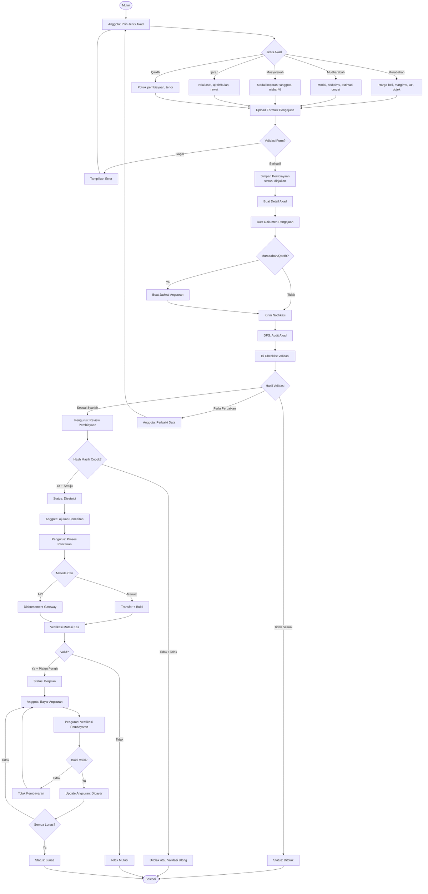

---

## 2. Setoran Simpanan

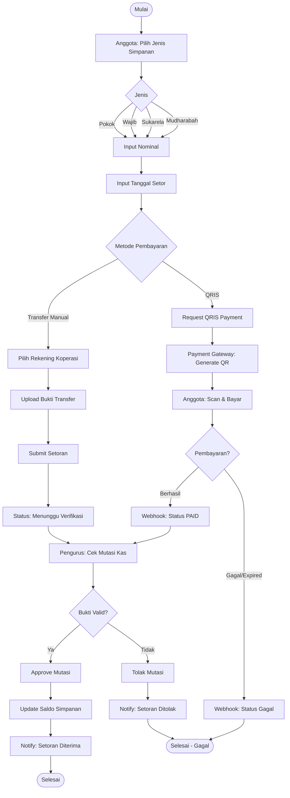

---

## 3. Bayar Angsuran

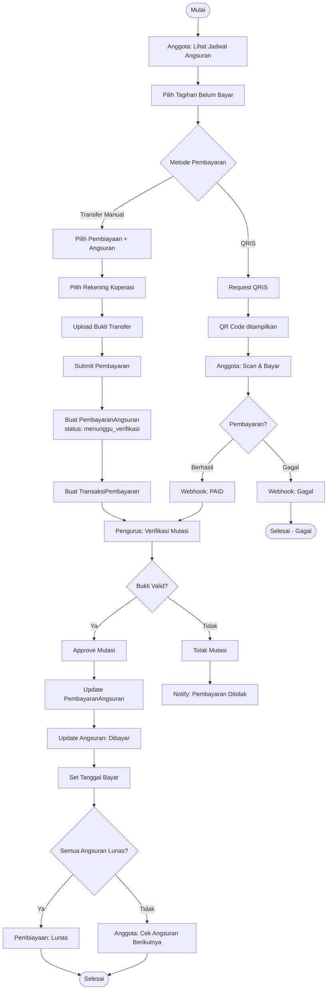

---

## 4. Pencairan Dana Pembiayaan

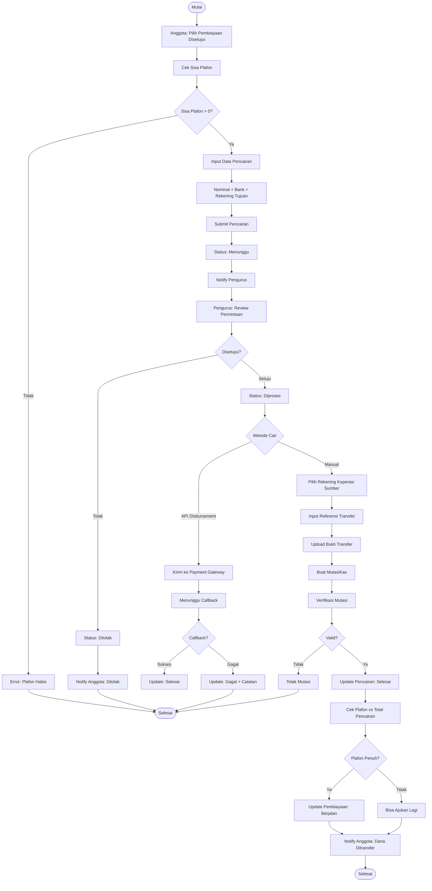

---

## 5. Marketplace Checkout

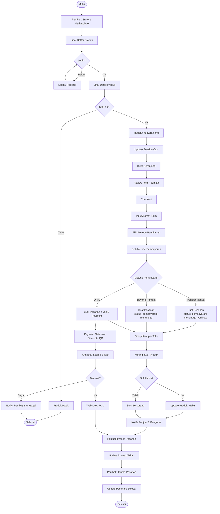

---

## 6. DPS Validasi Akad Syariah

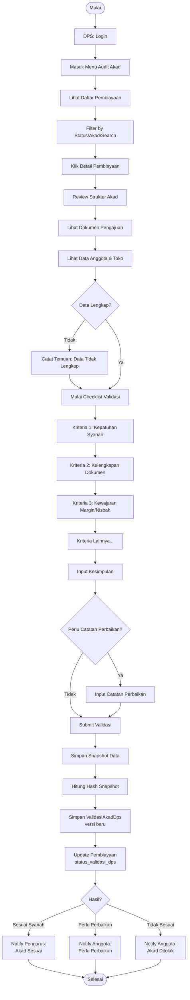

---

## 7. Toko & Produk Moderasi

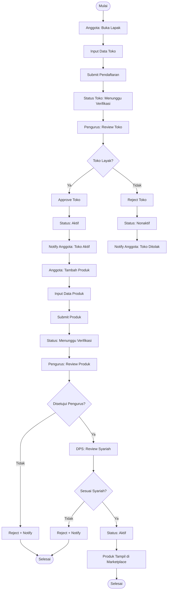

---

## 8. Mutasi Kas (Verifikasi Terpusat)

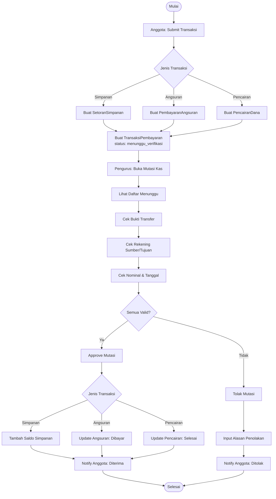

---

## 9. Pembayaran QRIS

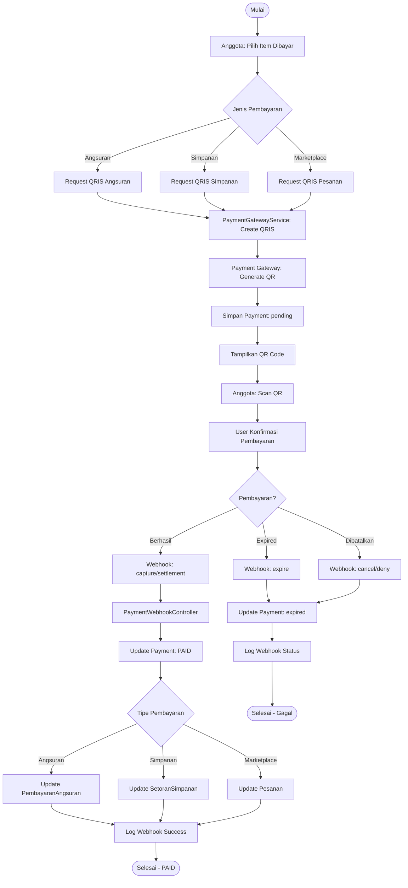

---

## 10. Login & Autentikasi

```mermaid
flowchart TD
    A([Mulai]) --> B{Sudah Login?}
    B -->|Ya| C[Redirect ke Dashboard]
    C --> Z([Selesai])
    B -->|Tidak| D[Input Email & Password]

    D --> E{Akun Ada?}
    E -->|Ya| F{Password Benar?}
    E -->|Tidak| G{Ingin Register?}
    G -->|Ya| H[Form Register]
    H --> I[Pilih Role: Anggota/Pelanggan]
    I --> J[Isi Data Registrasi]
    J --> K[Submit + Email Verifikasi]
    K --> Z
    G -->|Tidak| D

    F -->|Ya| L{Email Terverifikasi?}
    F -->|Tidak| M[Error: Password Salah]
    M --> D

    L -->|Ya| N[Cek Role Pengguna]
    L -->|Tidak| O[Pesan Verifikasi Email]
    O --> Z

    N --> P{Role?}
    P -->|admin| Q[/admin/dashboard]
    P -->|pengurus| R[/pengurus/dashboard]
    P -->|anggota| S[/anggota/dashboard]
    P -->|dps| T[/dps/dashboard]
    P -->|pelanggan| U[/pelanggan/dashboard]

    Q --> Z
    R --> Z
    S --> Z
    T --> Z
    U --> Z
```

---

## 11. Alur Notifikasi Sistem

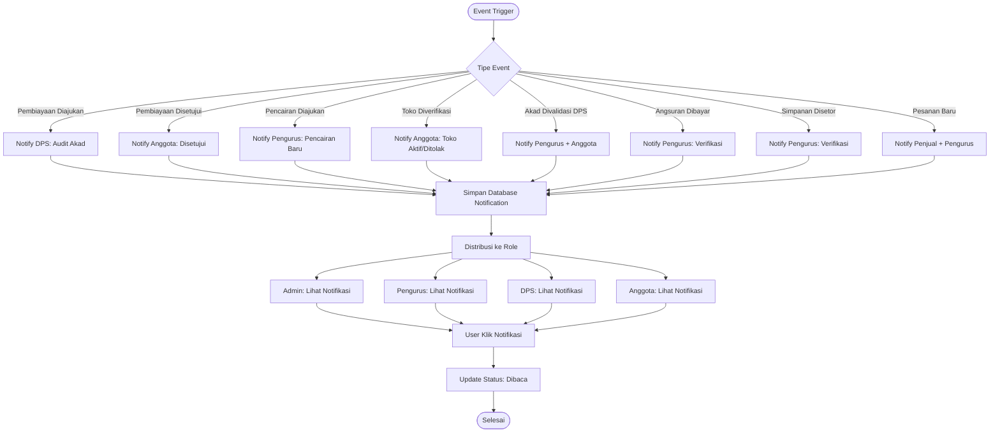

---

## State Diagrams

### Status Pembiayaan

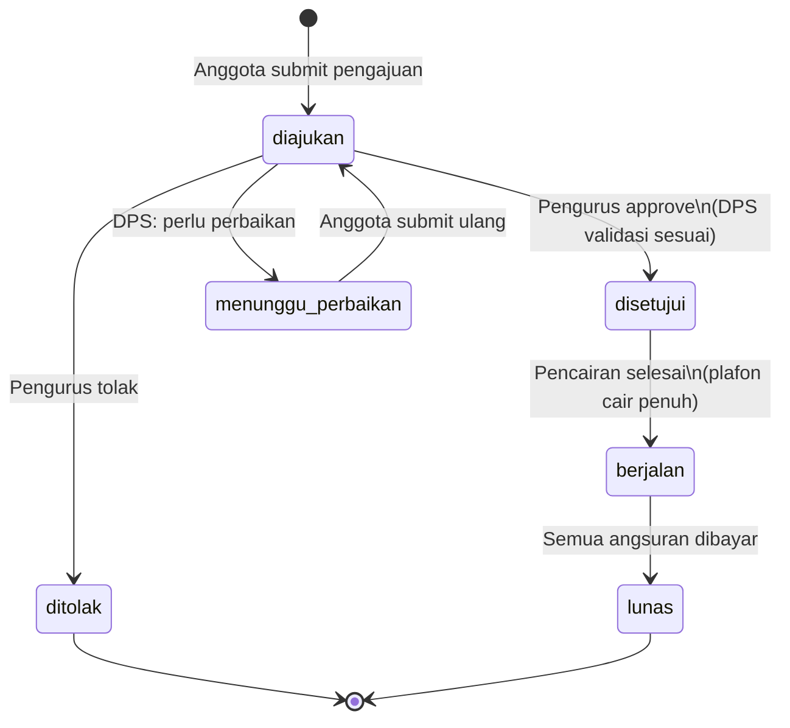

### Status Pencairan Dana

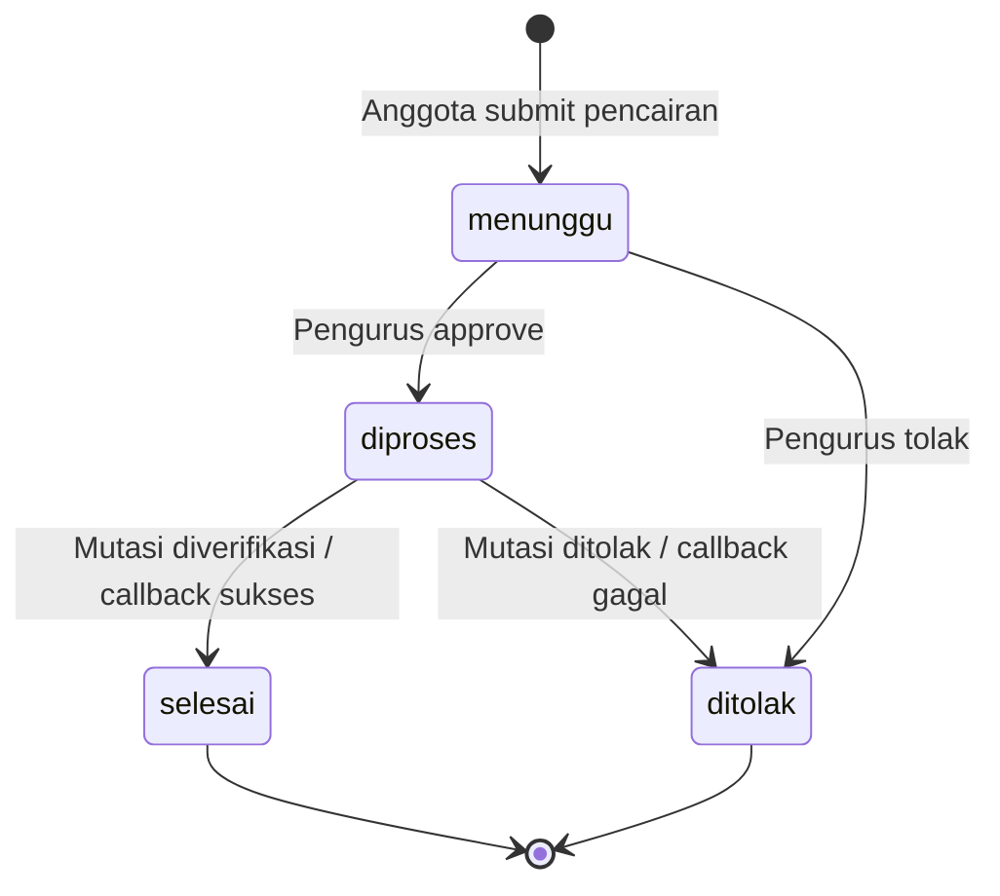

### Status Transaksi Kas

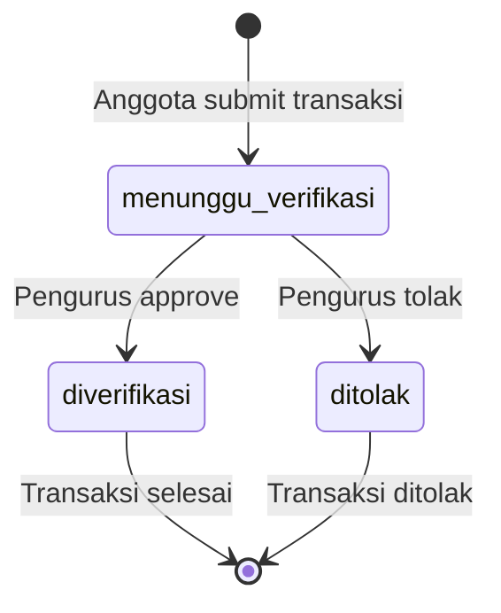

### Status Toko

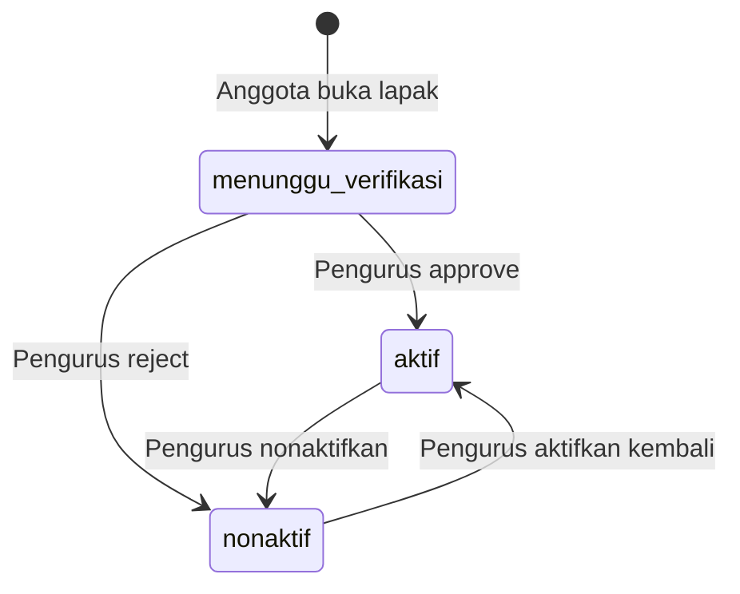
