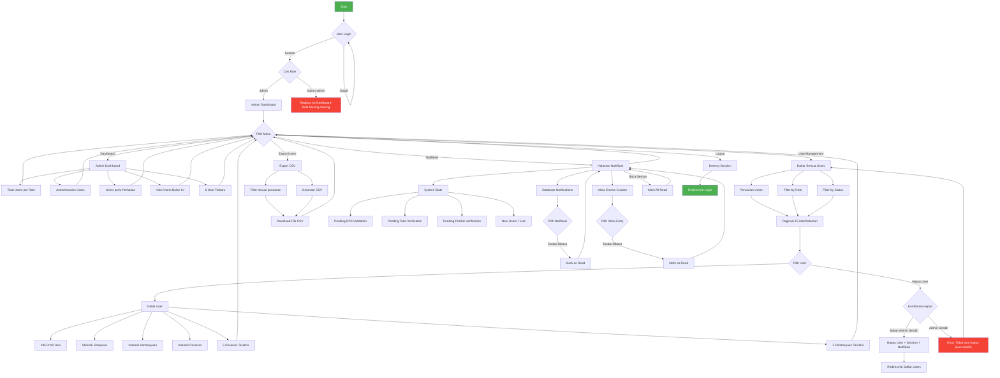

# Flowchart Role Admin

## Keterangan Flowchart

### 1. Autentikasi
- User melakukan login dengan email & password
- Middleware `auth` & `role:admin` memverifikasi akses
- Jika role bukan admin, redirect ke dashboard sesuai role

### 2. Admin Dashboard (`/admin/dashboard`)
- Menampilkan statistik lengkap pengguna
- Total users per role (admin, pengurus, DPS, anggota, pelanggan)
- Users aktif & nonaktif
- Users yang perlu perhatian (nonaktif + belum verifikasi)
- Users baru bulan ini
- 6 user terbaru

### 3. User Management (`/admin/users`)
- **Index**: Daftar semua users dengan filter & pencarian
- **Show**: Detail lengkap user + aktivitas (simpanan, pembiayaan, pesanan, toko, produk)
- **Destroy**: Hapus user (kecuali akun admin sendiri)
- **Export**: Download data users dalam format CSV

### 4. Notifikasi (`/admin/notifikasi`)
- Database notifications (Laravel built-in)
- Inbox entries (custom notification system)
- System stats: pending validasi DPS, verifikasi toko, verifikasi produk, new users 7 hari
- Tandai sudah dibaca per notifikasi atau sekaligus

### 5. Profil (`/profile`)
- Edit profil
- Update profil
- Hapus akun (dari `/auth/profile`)

## Routes yang Digunakan Admin

| Route | Method | Controller | Keterangan |
|-------|--------|------------|------------|
| `/admin/dashboard` | GET | AdminDashboardController@index | Dashboard admin |
| `/admin/users` | GET | AdminUserController@index | Daftar users |
| `/admin/users/{user}` | GET | AdminUserController@show | Detail user |
| `/admin/users/{user}` | DELETE | AdminUserController@destroy | Hapus user |
| `/admin/users/export` | GET | AdminUserController@export | Export CSV |
| `/admin/notifikasi` | GET | AdminNotificationController@index | Daftar notifikasi |
| `/admin/notifikasi/{id}/read` | POST | AdminNotificationController@markRead | Tandai dibaca |
| `/admin/notifikasi/read-all` | POST | AdminNotificationController@markAllRead | Tandai semua dibaca |
| `/profile` | GET | ProfileController@edit | Edit profil |
| `/profile` | PATCH | ProfileController@update | Update profil |
| `/profile` | DELETE | ProfileController@destroy | Hapus akun |
