# Diagram Alur Sistem Koperasi Syariah

Dokumen ini memakai Mermaid. Buka file ini di Markdown preview yang mendukung Mermaid, atau salin blok diagram ke https://mermaid.live.

## Aktor Sistem

- Admin: mengelola pengguna, memantau akses, melihat notifikasi sistem.
- Pengurus: mengelola anggota, menyetujui pembiayaan, pencairan dana, mutasi kas, rekening koperasi, toko, produk, dan notifikasi.
- Anggota: mengajukan pembiayaan, pencairan dana, pembayaran angsuran, setoran simpanan, lapak, produk, pesanan, wishlist, dan pembayaran QRIS.
- DPS: melakukan pengawasan syariah, audit akad, review produk, temuan, opini syariah, laporan pengawasan, dan notifikasi.
- Pelanggan: melihat marketplace, checkout, memantau pesanan, dan menandai pesanan diterima.
- Payment Gateway: mengirim callback pembayaran QRIS dan disbursement.

---

## Flowchart Sistem Umum

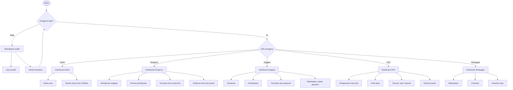

---

## Flowchart Per Aktor

### 1. Admin

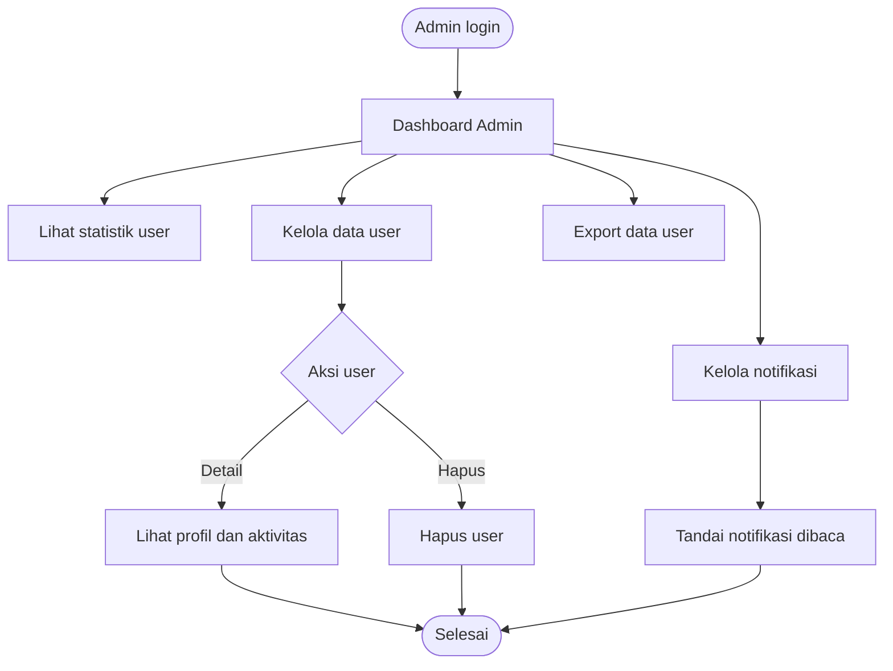

### 2. Pengurus

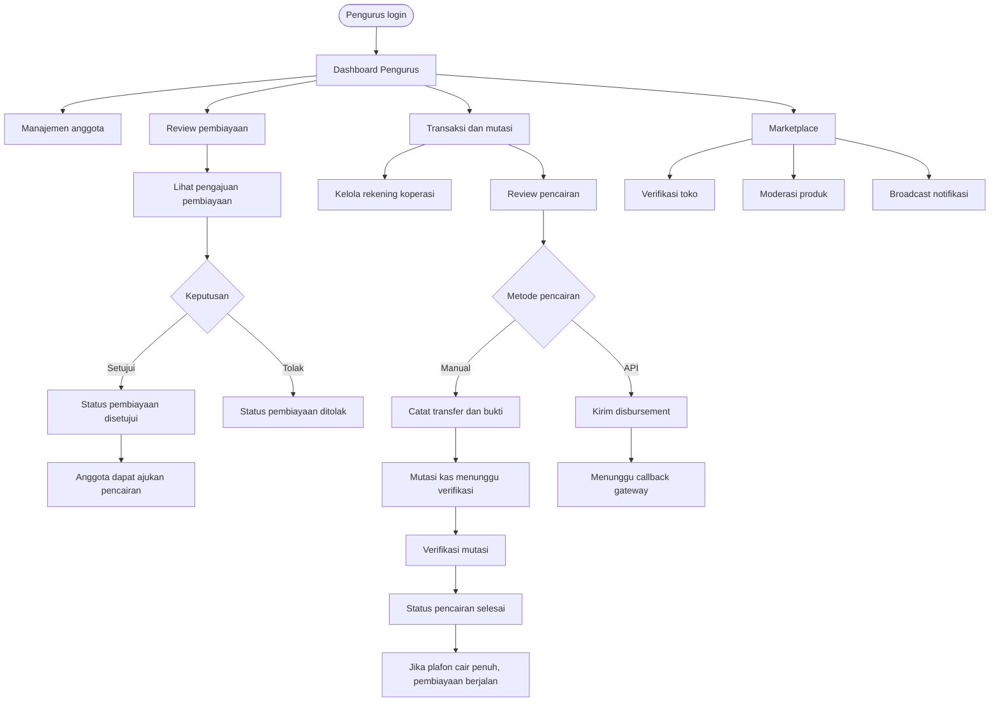

### 3. Anggota

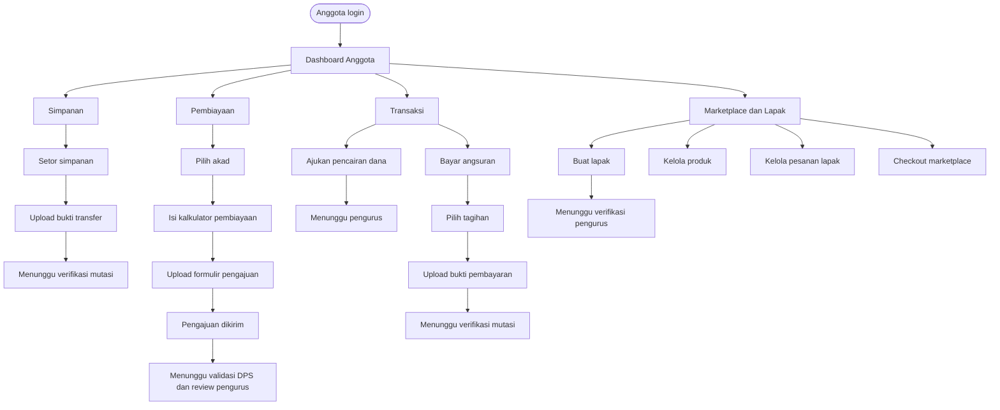

### 4. DPS

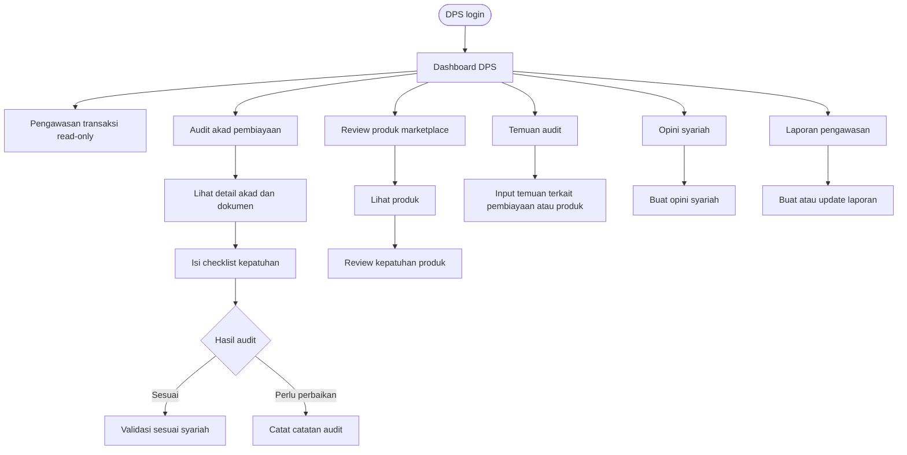

### 5. Pelanggan dan Publik

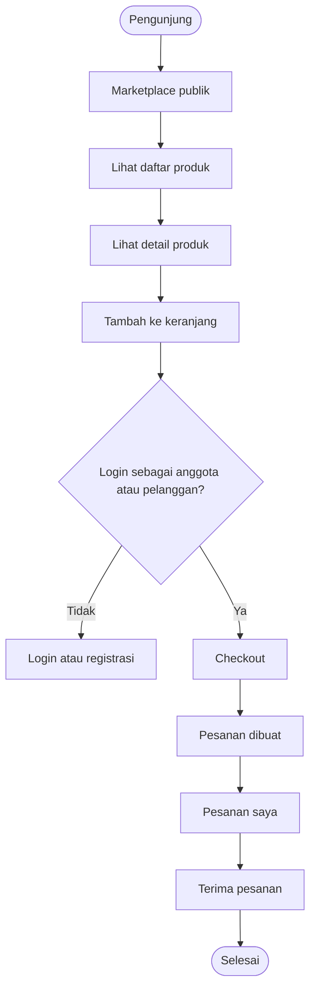

---

## Use Case Diagram

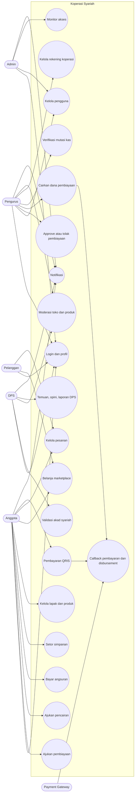

---

## Activity Diagram Pembiayaan Sampai Berjalan

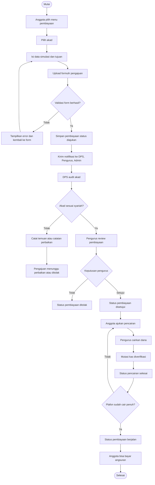

---

## Activity Diagram Simpanan dan Angsuran

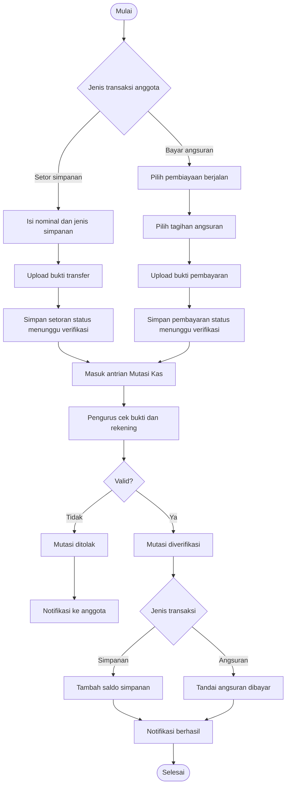

---

## Activity Diagram Marketplace dan Lapak

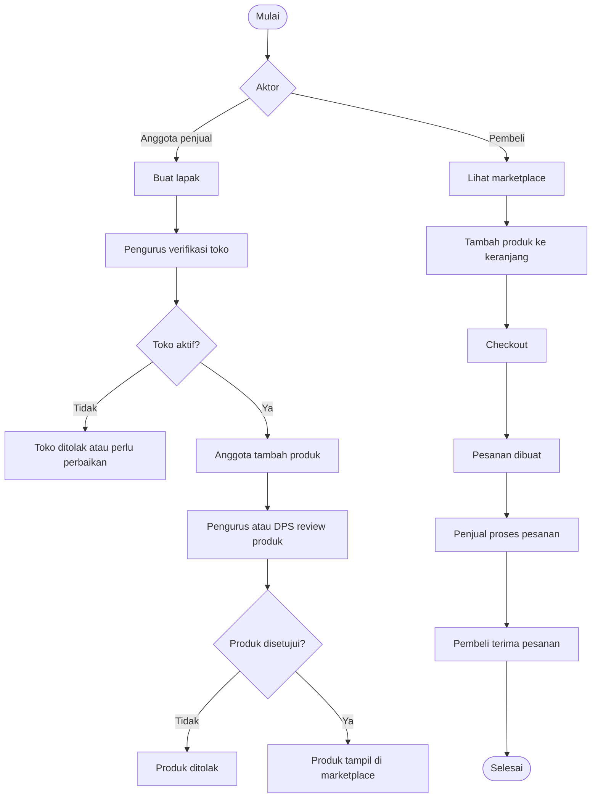

---

## Sequence Diagram Pengajuan Pembiayaan

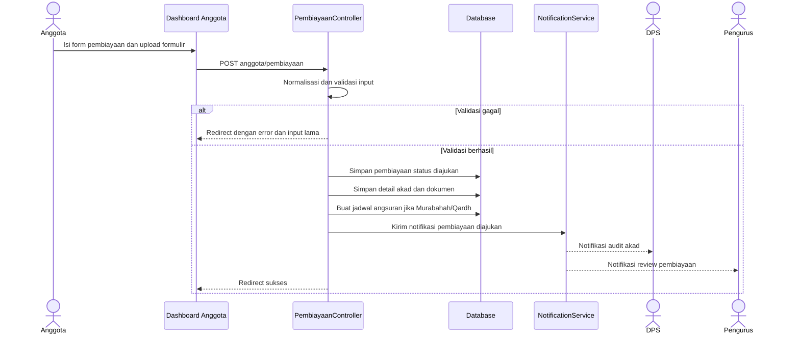

---

## Sequence Diagram Validasi DPS dan Persetujuan Pengurus

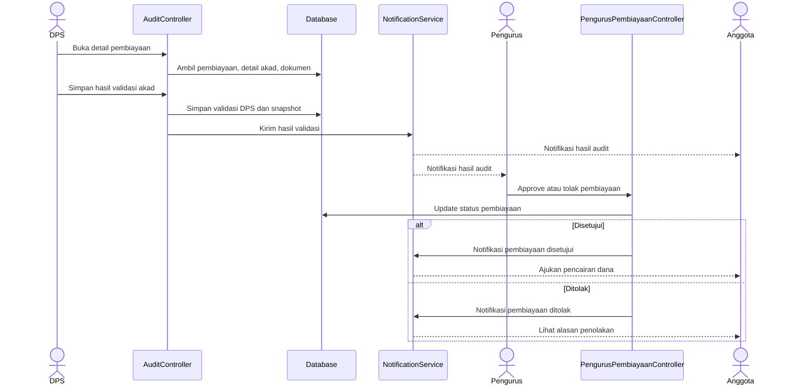

---

## Sequence Diagram Pencairan Dana Pembiayaan

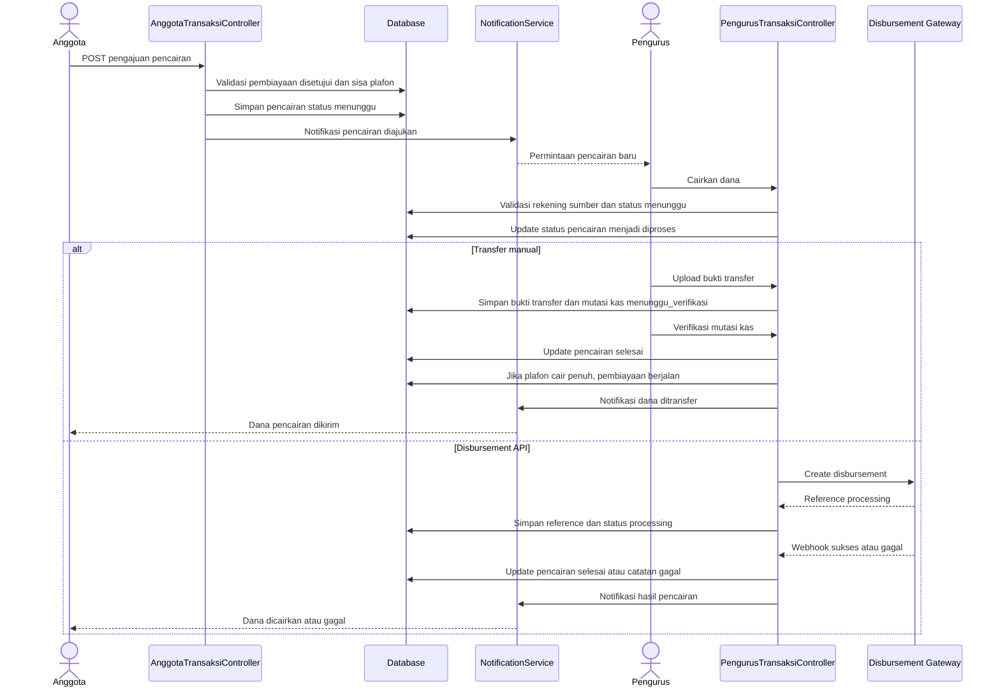

---

## Sequence Diagram Pembayaran Angsuran Manual

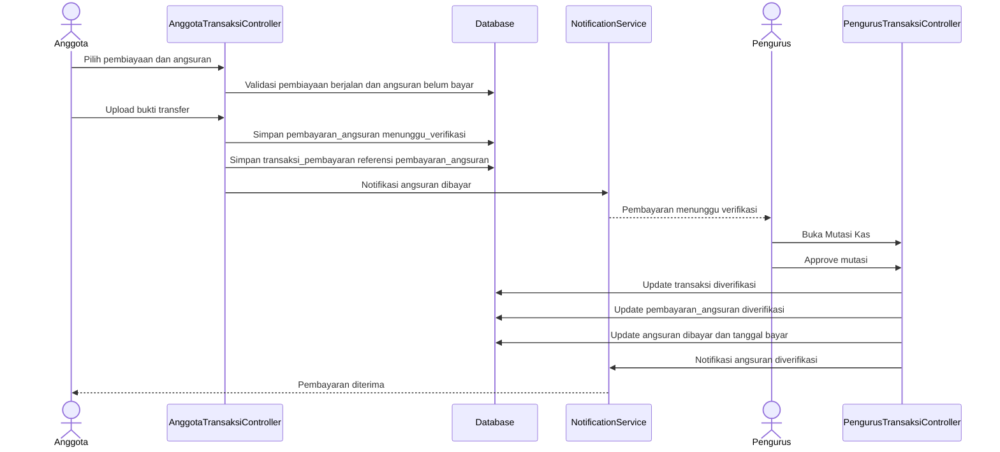

---

## Sequence Diagram Pembayaran QRIS

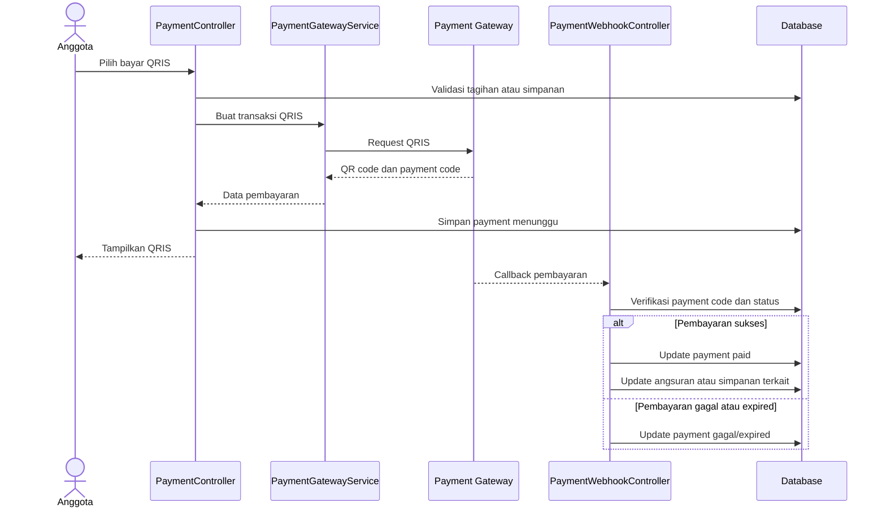

---

## Sequence Diagram Marketplace

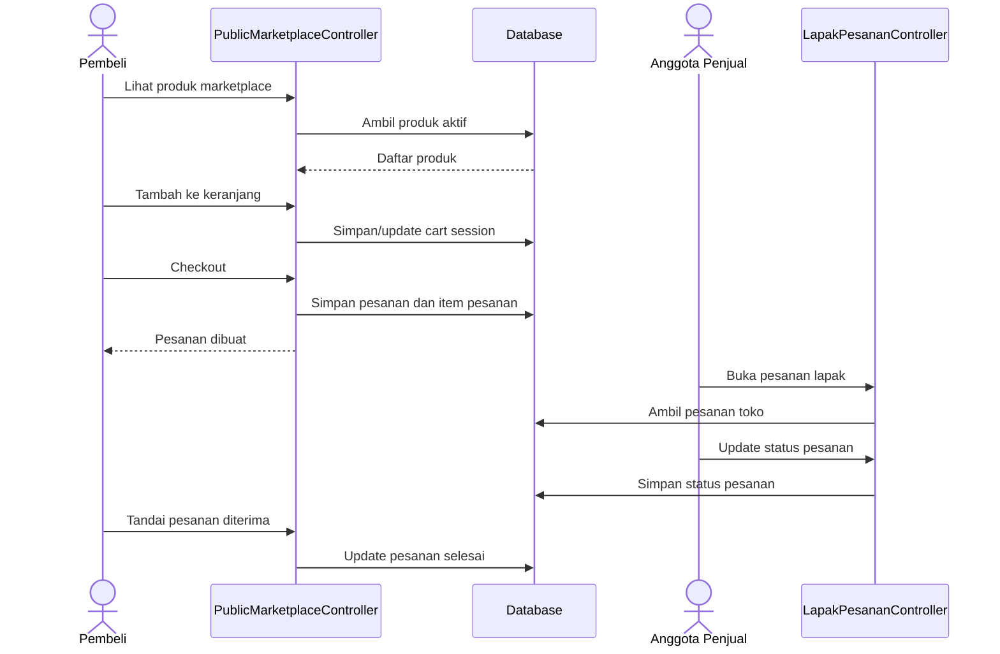

---

## Catatan Status Penting

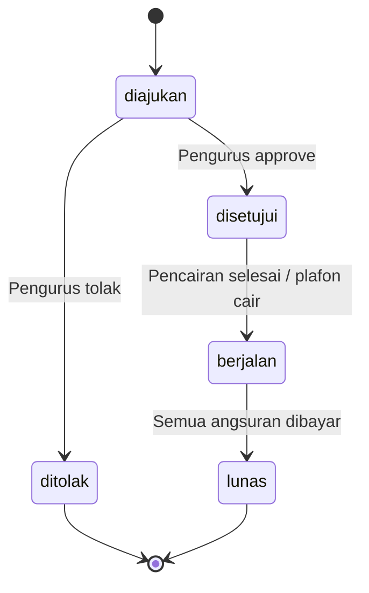

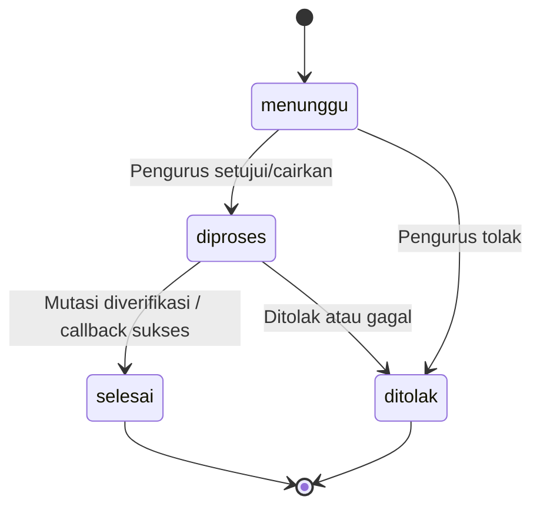