# 📊 Diagram Use Case, Sequence & Activity — Sistem Koperasi Marketplace

---

## 1. USE CASE DIAGRAM — SYSTEM OVERVIEW

```mermaid
graph TB
    subgraph Actors
        A["👤 Anggota<br/>(Penjual + Pembeli)"]
        P["🛒 Pelanggan<br/>(Pembeli)"]
        PG["👨‍💼 Pengurus<br/>(Admin Koperasi)"]
        DPS["⚖️ DPS<br/>(Dewan Pengawas Syariah)"]
        SYS["🔧 System<br/>(Payment Gateway)"]
    end

    subgraph "Marketplace"
        UC1["Browse Produk"]
        UC2["Lihat Detail Produk"]
        UC3["Kelola Keranjang"]
        UC4["Checkout"]
        UC5["Pembayaran"]
        UC6["Upload Bukti Transfer"]
        UC7["Konfirmasi Penerimaan"]
        UC8["Kelola Toko Saya"]
        UC9["Kelola Produk"]
        UC10["Proses Pesanan Masuk"]
        UC11["Konfirmasi Pembayaran"]
        UC12["Kelola Wishlist"]
    end

    subgraph "Koperasi"
        UC13["Lihat Simpanan"]
        UC14["Setor Simpanan"]
        UC15["Ajukan Pembiayaan"]
        UC16["Bayar Angsuran"]
        UC17["Lihat Bagi Hasil"]
        UC18["Monitoring Keuangan"]
    end

    subgraph "Moderasi & Pengawasan"
        UC19["Verifikasi Toko"]
        UC20["Moderasi Produk"]
        UC21["Review Opini Syariah"]
        UC22["Catat Temuan Audit"]
        UC23["Buat Laporan Pengawasan"]
    end

    subgraph "Transaksi Koperasi"
        UC24["Verifikasi Transaksi"]
        UC25["Proses Pencairan"]
        UC26["Mutasi Kas"]
        UC27["Kelola Rekening"]
    end

    subgraph "Sistem"
        UC28["Notifikasi Real-time"]
        UC29["Webhook Pembayaran"]
        UC30["Autentikasi & Otorisasi"]
    end

    A --> UC1
    A --> UC2
    A --> UC3
    A --> UC4
    A --> UC5
    A --> UC6
    A --> UC7
    A --> UC8
    A --> UC9
    A --> UC10
    A --> UC11
    A --> UC12
    A --> UC13
    A --> UC14
    A --> UC15
    A --> UC16
    A --> UC17
    A --> UC18

    P --> UC1
    P --> UC2
    P --> UC3
    P --> UC4
    P --> UC5
    P --> UC6
    P --> UC7
    P --> UC12

    PG --> UC19
    PG --> UC24
    PG --> UC25
    PG --> UC26
    PG --> UC27
    PG --> UC18

    DPS --> UC20
    DPS --> UC21
    DPS --> UC22
    DPS --> UC23
    DPS --> UC18

    SYS --> UC29
    SYS --> UC28

    UC4 -.->|<<include>>| UC3
    UC5 -.->|<<include>>| UC4
    UC6 -.->|<<extend>>| UC5
    UC11 -.->|<<extend>>| UC10
    UC7 -.->|<<extend>>| UC10
    UC19 -.->|<<include>>| UC8
    UC20 -.->|<<include>>| UC9
```

---

## 2. USE CASE DETAIL — MARKETPLACE

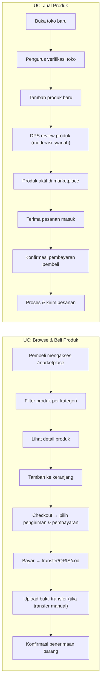

---

## 3. SEQUENCE DIAGRAM — Checkout & Pembayaran

### 3a. Checkout Lengkap

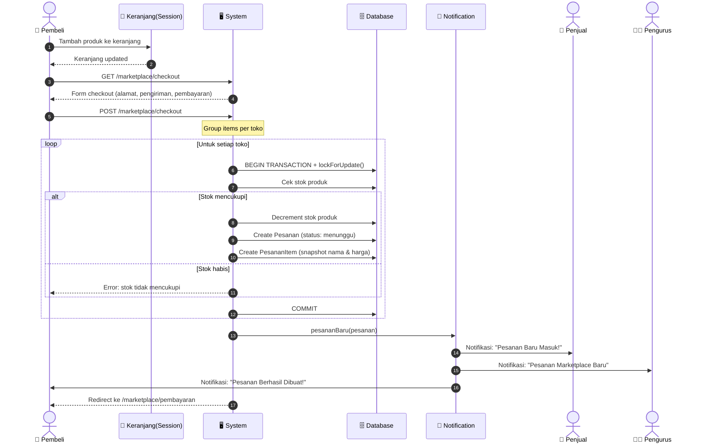

### 3b. Pembayaran Transfer Manual

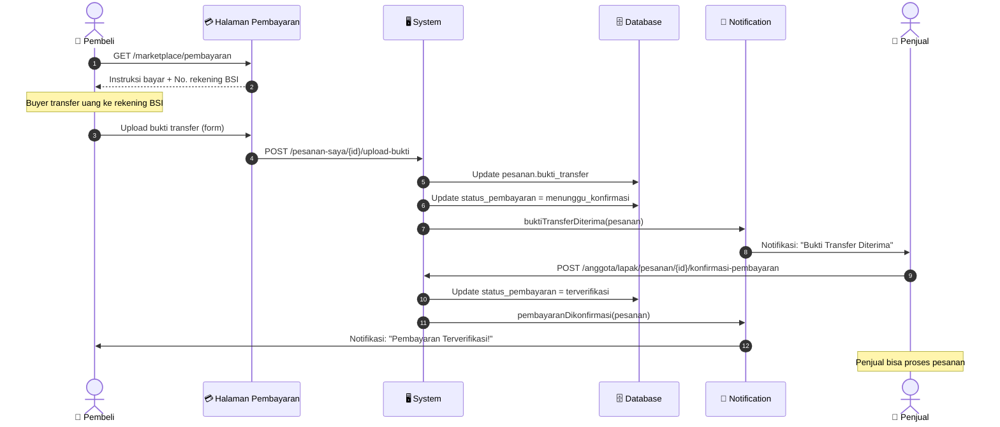

### 3c. Pembayaran QRIS

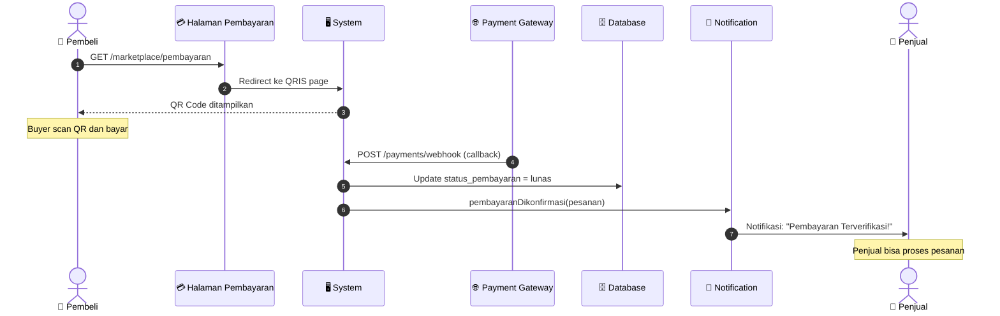

### 3d. Pembayaran Bayar di Tempat

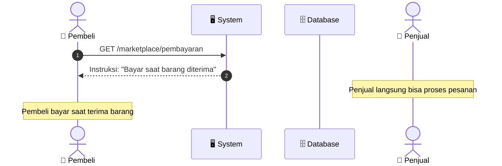

---

## 4. SEQUENCE DIAGRAM — Proses Penjual

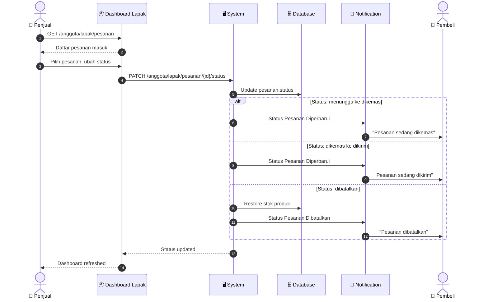

---

## 5. SEQUENCE DIAGRAM — Konfirmasi Penerimaan Pembeli

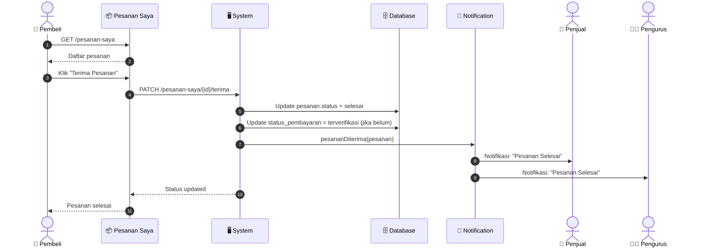

---

## 6. SEQUENCE DIAGRAM — Koperasi: Simpanan

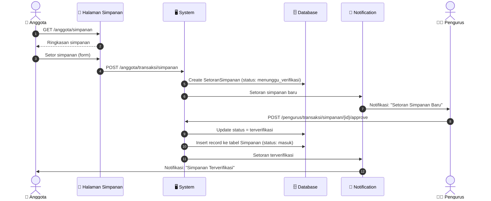

---

## 7. SEQUENCE DIAGRAM — Koperasi: Pembiayaan

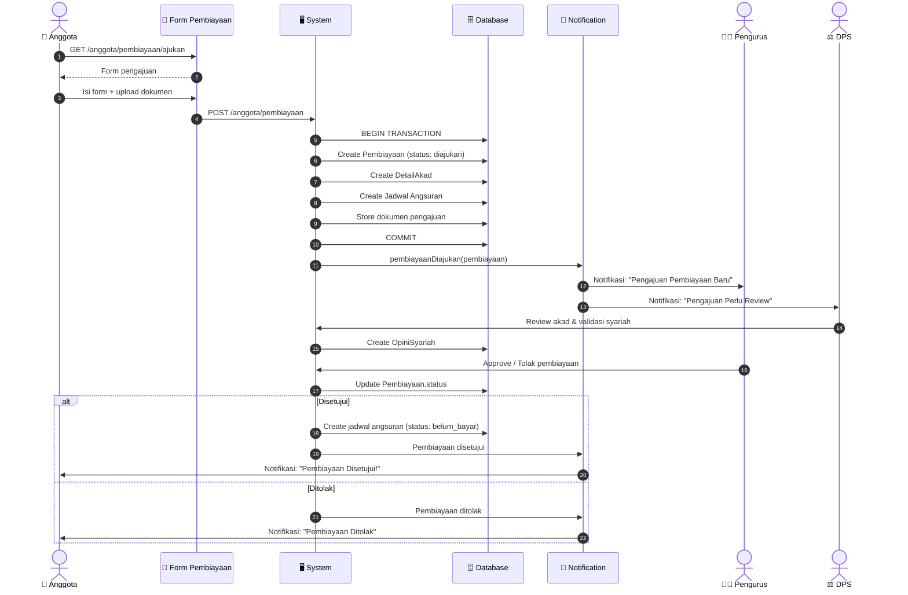

---

## 8. SEQUENCE DIAGRAM — Koperasi: Angsuran

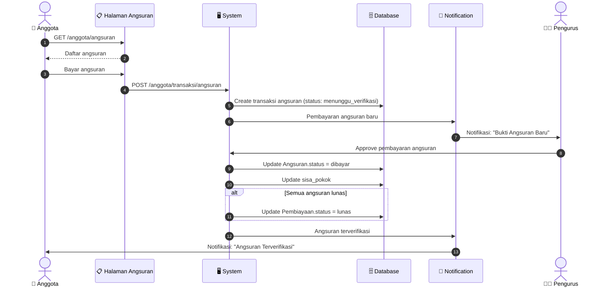

---

## 9. SEQUENCE DIAGRAM — Moderasi Produk (DPS)

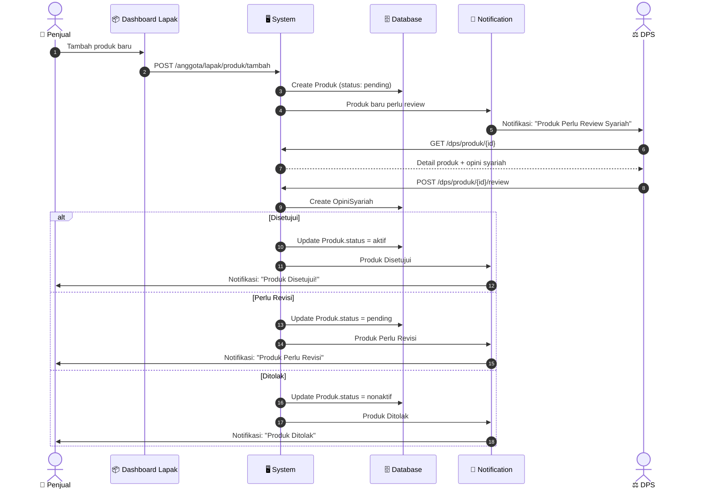

---

## 10. SEQUENCE DIAGRAM — Verifikasi Toko (Pengurus)

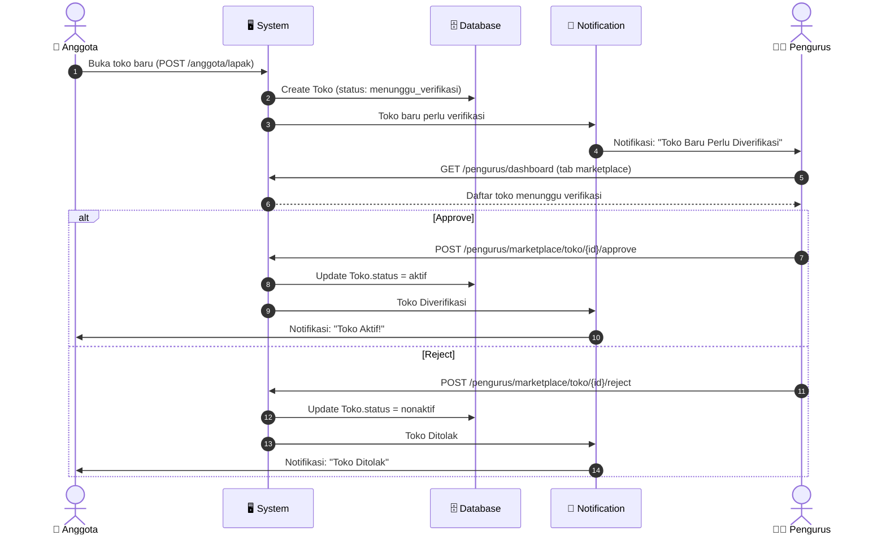

---

## 11. SEQUENCE DIAGRAM — Notifikasi Real-time

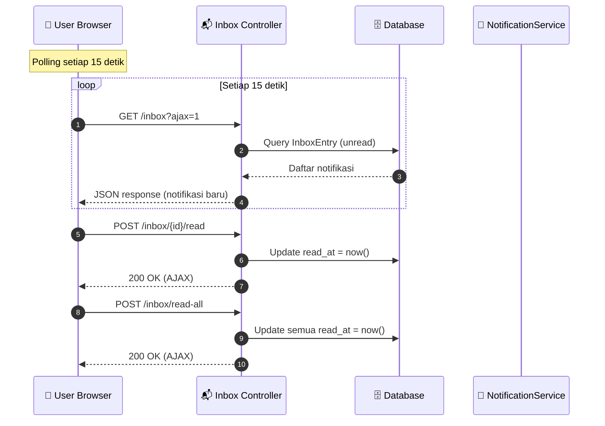

---

## 12. RINGKASAN ACTOR & USE CASE

| Actor | Use Case Utama |
|-------|---------------|
| **👤 Anggota** | Browse & beli produk, jual produk, kelola toko, kelola produk, proses pesanan, kelola simpanan, ajukan pembiayaan, bayar angsuran, lihat bagi hasil, monitoring keuangan |
| **🛒 Pelanggan** | Browse & beli produk, kelola keranjang, checkout, bayar, upload bukti transfer, konfirmasi terima |
| **👨‍💼 Pengurus** | Verifikasi toko, verifikasi transaksi, proses pencairan, mutasi kas, kelola rekening, monitoring marketplace |
| **⚖️ DPS** | Moderasi produk (review syariah), catat temuan audit, buat opini syariah, laporan pengawasan |
| **🔧 System** | Webhook pembayaran gateway, notifikasi real-time, autentikasi & otorisasi |

---

## 13. ALUR STATUS PESANAN

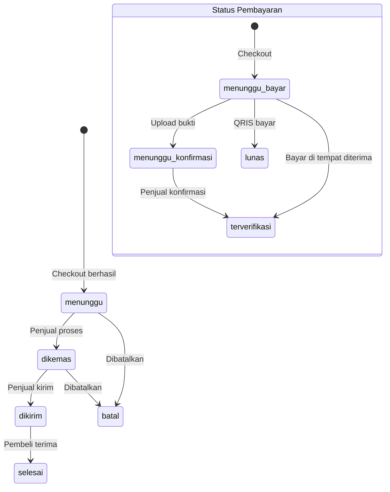

---

## 14. ALUR STATUS PEMBIAYAAN

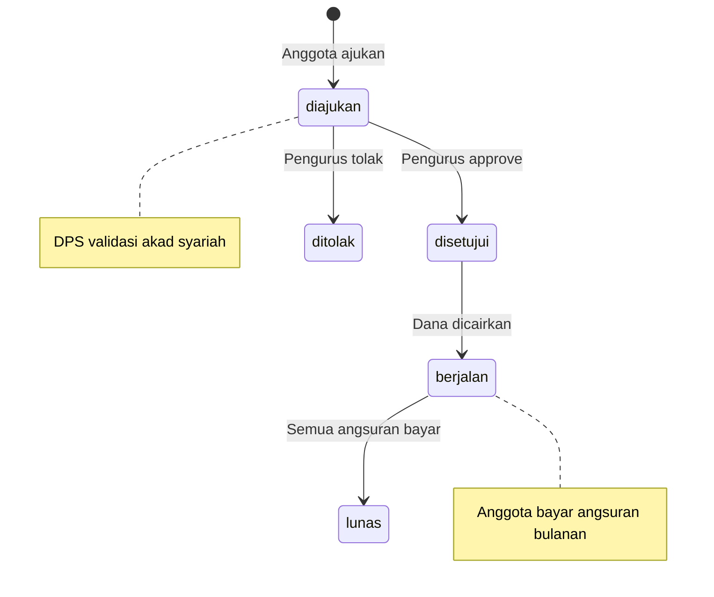

---

## 15. ACTIVITY DIAGRAM — Alur Pemesanan Marketplace (Pembeli)

```mermaid
flowchart TD
    Start([🛒 Mulai Belanja]) --> Browse["Browse Produk di Marketplace"]
    Browse --> Filter["Filter per Kategori"]
    Filter --> LihatDetail["Lihat Detail Produk"]

    LihatDetail --> PilihAksi{Pilih Aksi}

    PilihAksi -->|Tambah ke Keranjang| CekLogin{Sudah Login?}
    PilihAksi -->|Lihat Toko| LihatToko["Lihat Profil Toko"]
    PilihAksi -->|Wishlist| CekLogin2{Sudah Login?}

    CekLogin -->|Ya| TambahKeranjang["Produk ditambahkan ke keranjang"]
    CekLogin -->|Tabel redirect login| Login["Halaman Login"]
    Login --> Register{Sudah punya akun?}
    Register -->|Ya| Masuk["Masuk dengan email & password"]
    Register -->|Tabel| Daftar["Form Registrasi"]
    Daftar --> Verifikasi["Verifikasi Email"]
    Masuk --> TambahKeranjang
    Verifikasi --> TambahKeranjang

    CekLogin2 -->|Ya| SimpanWishlist["Disimpan ke Wishlist"]

    TambahKeranjang --> LanjutBelanja{Lanjut Belanja?}
    LanjutBelanja -->|Ya| Browse
    LanjutBelanja -->|Tabel ke Checkout| LihatKeranjang["Lihat Keranjang"]

    LihatKeranjang --> EditQty{Edit Jumlah?}
    EditQty -->|Ya| UpdateQty["Update Jumlah Item"]
    EditQty -->|Tabel| Checkout

    UpdateQty --> Checkout

    Checkout --> IsiForm["Isi Form Checkout:\n- Alamat Pengiriman\n- Metode Pengiriman\n- Metode Pembayaran"]
    IsiForm --> PilihPengiriman{Pilih Pengiriman}

    PilihPengiriman -->|Ambil di Toko| Ongkir0["Ongkir: Gratis"]
    PilihPengiriman -->|Diantar Penjual| Ongkir5["Ongkir: Rp 5.000"]
    PilihPengiriman -->|Kurir Lokal| Ongkir10["Ongkir: Rp 10.000"]

    Ongkir0 --> HitungTotal
    Ongkir5 --> HitungTotal
    Ongkir10 --> HitungTotal

    HitungTotal["Hitung Total Pembayaran"]
    HitungTotal --> Konfirmasi["Konfirmasi Checkout"]

    Konfirmasi --> CekStok{"Cek Stok Produk"}

    CekStok -->|Stok Cukup| BuatPesanan["Buat Pesanan per Toko\n(decrypt stok, snapshot harga)"]
    CekStok -->|Stok Habis| ErrorStok["Error: Stok Tidak Mencukupi"]
    ErrorStok --> LihatKeranjang

    BuatPesanan --> KirimNotif["Kirim Notifikasi:\n- Pembeli: Pesanan Berhasil\n- Penjual: Pesanan Baru\n- Pengurus: Monitoring"]

    KirimNotif --> HalamanBayar["Redirect ke Halaman Pembayaran"]

    HalamanBayar --> PilihBayar{Pilih Metode Bayar}

    PilihBayar -->|Transfer Manual| LihatRekening["Lihat No. Rekening BSI"]
    PilihBayar -->|QRIS| ScanQR["Scan QR Code"]
    PilihBayar -->|Bayar di Tempat| InstruksiCOD["Bayar saat terima barang"]

    LihatRekening --> Transfer["Transfer uang ke rekening"]
    Transfer --> UploadBukti["Upload Bukti Transfer"]
    UploadBukti --> MenungguKonfirmasi["Menunggu Konfirmasi Penjual"]
    MenungguKonfirmasi --> PenjualKonfirm{Penjual Konfirmasi?}
    PenjualKonfirm -->|Ya| PembayaranTerverifikasi["Pembayaran Terverifikasi"]
    PenjualKonfirm -->|Menunggu| MenungguKonfirmasi

    ScanQR --> Webhook["Payment Gateway Webhook"]
    Webhook --> PembayaranTerverifikasi

    InstruksiCOD --> ProsesPesanan

    PembayaranTerverifikasi --> ProsesPesanan["Penjual Proses Pesanan"]
    ProsesPesanan --> StatusDikemas["Status: Dikemas"]
    StatusDikemas --> StatusDikirim["Status: Dikirim"]
    StatusDikirim --> KonfirmasiTerima{Konfirmasi Terima?}
    KonfirmasiTerima -->|Ya| Selesai["Pesanan Selesai"]
    KonfirmasiTerima -->|Menunggu| StatusDikirim

    Selesai --> End([✅ Selesai])
```

---

## 16. ACTIVITY DIAGRAM — Alur Proses Pesanan (Penjual)

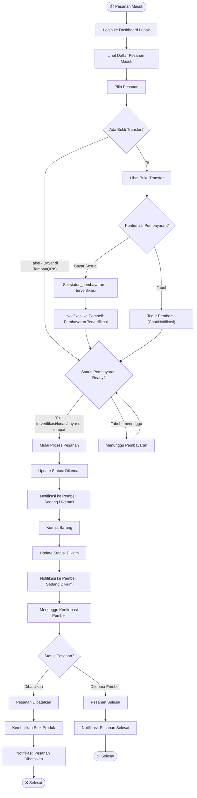

---

## 17. ACTIVITY DIAGRAM — Alur Pembayaran (3 Metode)

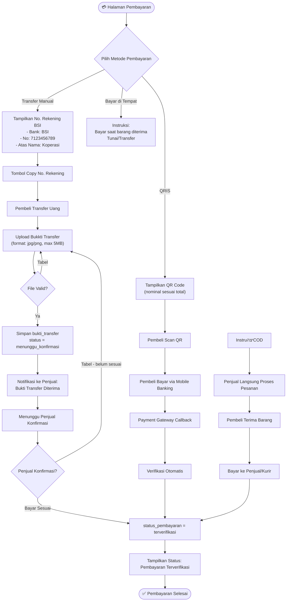

---

## 18. ACTIVITY DIAGRAM — Alur Pengajuan Pembiayaan

```mermaid
flowchart TD
    Start([📝 Ajukan Pembiayaan]) --> Login["Login sebagai Anggota"]
    Login --> CekToko{Punya Toko?}

    CekToko -->|Ya| PilihTujuan["Pilih Tujuan Pembiayaan"]
    CekToko -->|Tabel| BukaToko["Buka Toko Baru dulu"]

    BukaToko --> TungguVerifikasiToko["Menunggu Verifikasi Pengurus"]
    TungguVerifikasiToko --> TokoAktif["Toko Aktif"]
    TokoAktif --> PilihTujuan

    PilihTujuan --> PilihAkad["Pilih Jenis Akad:\n- Murabahah\n- Mudharabah\n- Musyarakah\n- Ijarah\n- Qardh"]

    PilihAkad --> IsiForm["Isi Form Pengajuan"]
    IsiForm --> UploadDokumen["Upload Formulir Pengajuan\n(PDF/DOC, max 8MB)"]
    UploadDokumen --> Validasi["Validasi Form"]

    Validasi --> CekValid{Valid?}
    CekValid -->|Tabel| IsiForm
    CekValid -->|Ya| SimpanData["Simpan ke Database:\n- Pembiayaan (status: diajukan)\n- DetailAkad\n- Jadwal Angsuran\n- Dokumen"]

    SimpanData --> NotifAll["Notifikasi ke:\n- Pengurus: Pengajuan Baru\n- DPS: Perlu Review Syariah"]

    NotifAll --> DPSReview["DPS Review Akad & Syariah"]
    DPSReview --> BuatOpini["DPS Buat Opini Syariah"]
    BuatOpini --> PengurusReview["Pengurus Review & Validasi"]

    PengurusReview --> Keputusan{Keputusan?}
    Keputusan -->|Disetujui| Setuju["Status: Disetujui"]
    Keputusan -->|Ditolak| Tolak["Status: Ditolak"]

    Setuju --> NotifSetuju["Notifikasi: Pembiayaan Disetujui"]
    Tolak --> NotifTolak["Notifikasi: Pembiayaan Ditolak"]

    NotifSetuju --> CairkanDana["Dana Dicairkan"]
    CairkanDana --> StatusBerjalan["Status: Berjalan"]
    StatusBerjalan --> BayarAngsuran["Bayar Angsuran Bulanan"]

    BayarAngsuran --> CekLunas{Semua Lunas?}
    CekLunas -->|Tabel| BayarAngsuran
    CekLunas -->|Ya| Lunas["Status: Lunas"]

    Lunas --> End([✅ Pembiayaan Selesai])
    NotifTolak --> End2([❌ Ditolak])
```

---

## 19. ACTIVITY DIAGRAM — Alur Setor Simpanan

```mermaid
flowchart TD
    Start([🏦 Setor Simpanan]) --> Login["Login sebagai Anggota"]
    Login --> LihatSimpanan["Lihat Ringkasan Simpanan"]
    LihatSimpanan --> PilihJenis["Pilih Jenis Simpanan:\n- Pokok\n- Wajib\n- Sukarela\n- Mudharabah"]

    PilihJenis --> IsiNominal["Isi Nominal Setoran"]
    IsiNominal --> UploadBukti["Upload Bukkti Transfer"]
    UploadBukti --> Konfirmasi["Konfirmasi Setoran"]

    Konfirmasi --> Simpan["Simpan ke Database:\nSetoranSimpanan\n(status: menunggu_verifikasi)"]
    Simpan --> Notif["Notifikasi ke Pengurus:\nSetoran Simpanan Baru"]

    Notif --> Tunggu["Menunggu Verifikasi Pengurus"]
    Tunggu --> Pengurus{Pengurus Verifikasi?}

    Pengurus -->|Approve| Terverifikasi["Status: Terverifikasi"]
    Pengurus -->|Tolak| Ditolak["Status: Ditolak"]

    Terverifikasi --> UpdateSimpanan["Insert ke Tabel Simpanan\n(status: masuk)"]
    UpdateSimpanan --> NotifAnggota["Notifikasi ke Anggota:\nSimpanan Terverifikasi"]
    NotifAnggota --> End([✅ Selesai])

    Ditolak --> NotifTolak["Notifikasi ke Anggota:\nSetoran Ditolak"]
    NotifTolak --> End2([❌ Ditolak])
```

---

## 20. ACTIVITY DIAGRAM — Alur Bayar Angsuran

```mermaid
flowchart TD
    Start([💰 Bayar Angsuran]) --> Login["Login sebagai Anggota"]
    Login --> LihatAngsuran["Lihat Daftar Angsuran"]
    LihatAngsuran --> PilihAngsuran["Pilih Angsuran yang Belum Dibayar"]

    PilihAngsuran --> CekJatuhTempo{Jatuh Tempo?}
    CekJatuhTempo -->|Sudah Jatuh Tempo| Warning["Peringatan: Angsuran Terlambat"]
    CekJatuhTempo -->|Masih Waktu| Lanjut

    Warning --> Lanjut["Lanjut ke Pembayaran"]
    Lanjut --> PilihMetode["Pilih Metode Bayar:\n- Transfer Manual\n- QRIS"]

    PilihMetode -->|Transfer Manual| FormTransfer["Form Upload Bukti Transfer"]
    PilihMetode -->|QRIS| BayarQR["Bayar via QR Code"]

    FormTransfer --> SubmitBukti["Submit Bukkti Transfer"]
    SubmitBukti --> NotifAdmin["Notifikasi ke Pengurus:\nBukti Angsuran Baru"]
    BayarQR --> VerifikasiOtomatis["Verifikasi Otomatis"]

    NotifAdmin --> TungguAdmin["Menunggu Verifikasi Pengurus"]
    TungguAdmin --> Admin{Pengurus Approve?}

    Admin -->|Approve| UpdateAngsuran["Update Angsuran.status = dibayar\nUpdate sisa_pokok"]
    Admin -->|Tolak| Kembali["Kembali ke Form"]
    Kembali --> FormTransfer

    UpdateAngsuran --> CekLunas{Semua Angsuran Lunas?}
    CekLunas -->|Tabel| End([✅ Angsuran Dibayar])
    CekLunas -->|Ya| PembiayaanLunas["Update Pembiayaan.status = lunas"]
    VerifikasiOtomatis --> UpdateAngsuran
    PembiayaanLunas --> End2([🎉 Pembiayaan Lunas])
```

---

## 21. ACTIVITY DIAGRAM — Alur Moderasi Produk (DPS)

```mermaid
flowchart TD
    Start([⚖️ Moderasi Produk]) --> Login["Login sebagai DPS"]
    Login --> LihatDaftar["Lihat Daftar Produk Pending"]
    LihatDaftar --> Filter["Filter: Status, Search"]
    Filter --> PilihProduk["Pilih Produk untuk Direview"]

    PilihProduk --> LihatDetail["Lihat Detail Produk:\n- Nama, Harga, Stok\n- Deskripsi, Foto\n- Toko & Kategori"]
    LihatDetail --> CekOpini{Ada Opini Sebelumnya?}

    CekOpini -->|Ya| LihatOpini["Lihat Opini Syariah Sebelumnya"]
    CekOpini -->|Tabel| Review

    LihatOpini --> Review["Review Produk"]

    Review --> Keputusan{Keputusan Syariah?}
    Keputusan -->|Disetujui| Setuju["Buat Opini: Disetujui\n(status produk = aktif)"]
    Keputusan -->|Perlu Revisi| Revisi["Buat Opini: Perlu Revisi\n(status produk = pending)"]
    Keputusan -->|Ditolak| Tolak["Buat Opini: Ditolak\n(status produk = nonaktif)"]

    Setuju --> SimpanOpini["Simpan OpiniSyariah"]
    Revisi --> SimpanOpini
    Tolak --> SimpanOpini

    SimpanOpini --> Notif["Notifikasi ke Penjual:\nHasil Review Produk"]
    Notif --> End([✅ Review Selesai])
```

---

## 22. ACTIVITY DIAGRAM — Alur Verifikasi Toko (Pengurus)

```mermaid
flowchart TD
    Start([👨‍💼 Verifikasi Toko]) --> Login["Login sebagai Pengurus"]
    Login --> Dashboard["Buka Dashboard - Tab Marketplace"]
    Dashboard --> LihatToko["Lihat Daftar Toko Menunggu Verifikasi"]

    LihatToko --> PilihToko["Pilih Toko"]
    PilihToko --> LihatDetail["Lihat Detail Toko:\n- Nama Toko\n- Pemilik\n- Kategori\n- Status Saat Ini"]

    LihatDetail --> Keputusan{Keputusan?}
    Keputusan -->|Approve| Aktifkan["Update Toko.status = aktif"]
    Keputusan -->|Reject| Nonaktifkan["Update Toko.status = nonaktif"]

    Aktifkan --> NotifAktif["Notifikasi ke Pemilik:\nToko Aktif! Bisa Jualan"]
    Nonaktifkan --> NotifNonaktif["Notifikasi ke Pemilik:\nToko Ditolak"]

    NotifAktif --> End([✅ Toko Diverifikasi])
    NotifNonaktif --> End2([❌ Toko Ditolak])
```

---

## 23. ACTIVITY DIAGRAM — Alur Autentikasi & Otorisasi

```mermaid
flowchart TD
    Start([🔐 Akses Aplikasi]) --> CekLogin{Sudah Login?}

    CekLogin -->|Tabel| HalamanLogin["Halaman Login"]
    HalamanLogin --> InputCredentials["Input Email & Password"]
    InputCredentials --> Validasi{Valid?}

    Validasi -->|Tabel| LoginError["Error: Email/Password Salah"]
    LoginError --> HalamanLogin

    Validasi -->|Ya| CekVerifikasi{Email Terverifikasi?}
    CekVerifikasi -->|Tabel| BelumVerifikasi["Halaman Verifikasi Email"]
    BelumVerifikasi --> KirimEmail["Kirim Email Verifikasi"]
    KirimEmail --> KlikLink["Klik Link Verifikasi"]
    KlikLink --> CekRole

    CekVerifikasi -->|Ya| CekRole{Role User?}

    CekLogin -->|Ya| CekRole

    CekRole -->|admin| AdminDash["Dashboard Admin"]
    CekRole -->|pengurus| PengurusDash["Dashboard Pengurus"]
    CekRole -->|anggota| AnggotaDash["Dashboard Anggota"]
    CekRole -->|pelanggan| PelangganDash["Dashboard Pelanggan"]
    CekRole -->|dps| DPSDash["Dashboard DPS"]

    AnggotaDash --> CekToko{Punya Toko?}
    CekToko -->|Ya| TabPenjual["Tab: Pesanan Masuk, Toko Saya, Produk"]
    CekToko -->|Tabel| TabAnggota["Tab: Simpanan, Pembiayaan, Angsuran"]

    TabPenjual --> Marketplace["Marketplace Features"]
    TabAnggota --> Koperasi["Koperasi Features"]

    Marketplace --> End([✅ Dashboard Loaded])
    Koperasi --> End
    AdminDash --> End
    PengurusDash --> End
    PelangganDash --> End
    DPSDash --> End
```

---

*Diagram ini dibuat menggunakan Mermaid syntax. Untuk melihat visualisasinya, gunakan:*
- *VS Code dengan extension "Mermaid Preview"*
- *GitHub/GitLab markdown viewer*
- *Online: [mermaid.live](https://mermaid.live)*
