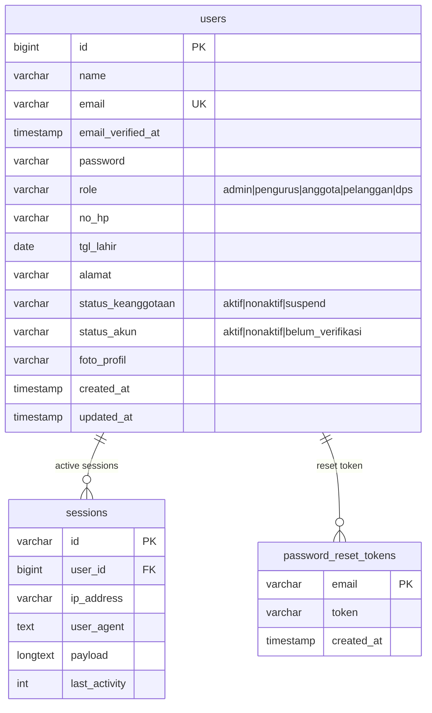
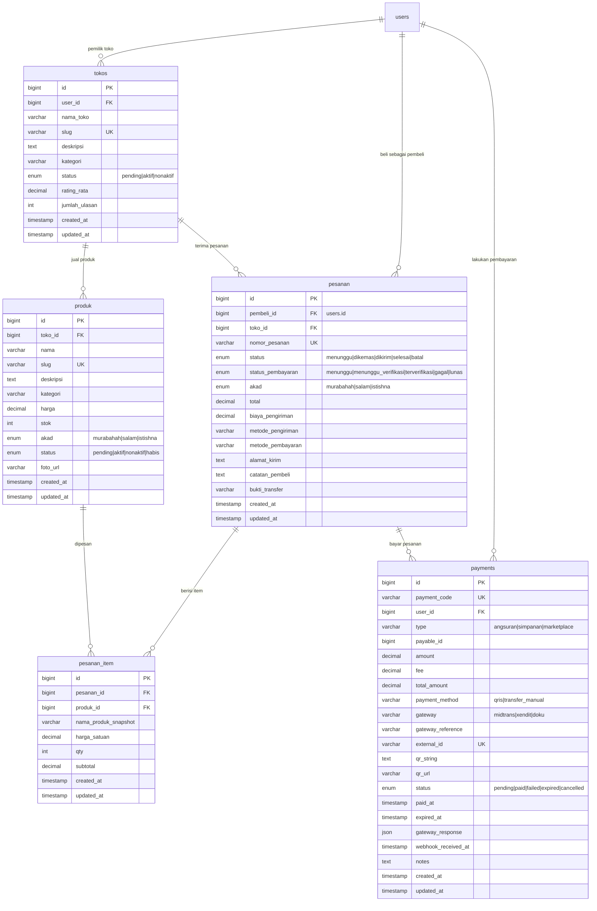
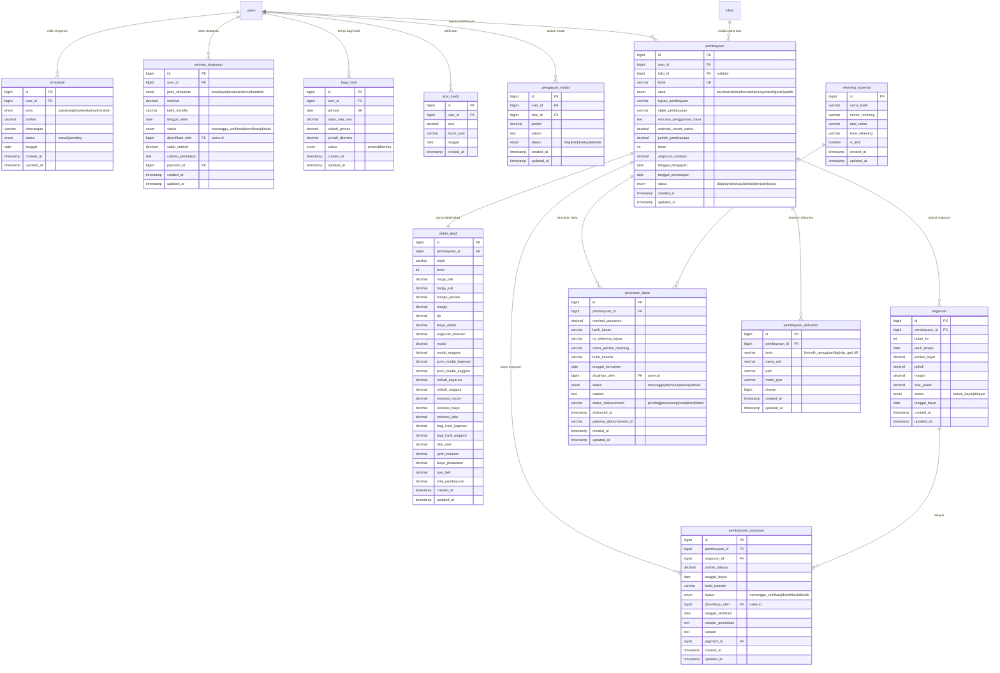
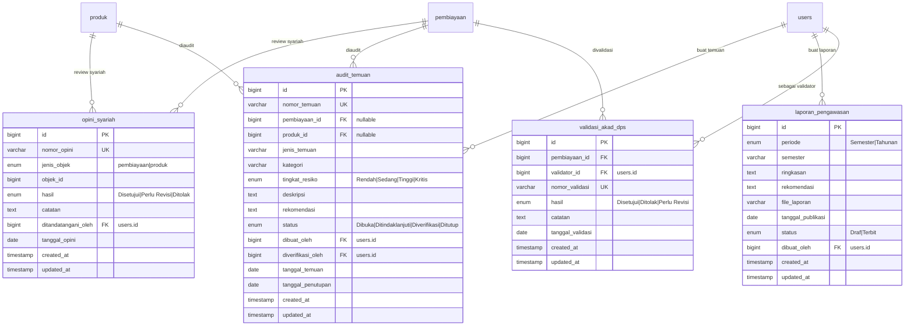
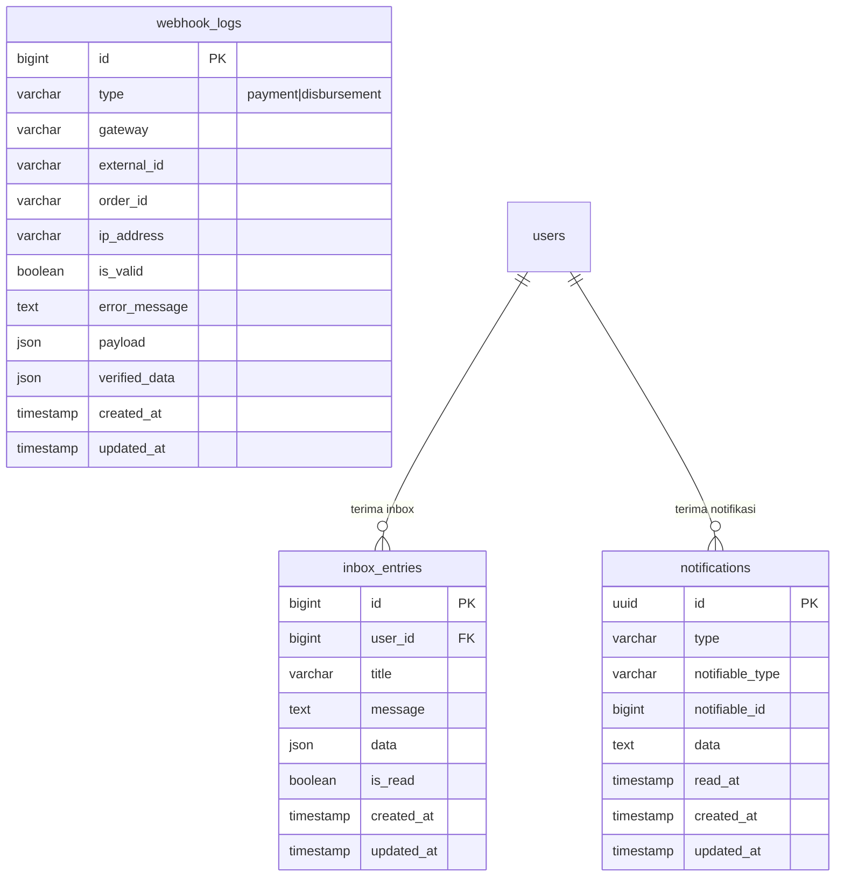

# 🗄️ ERD (Entity Relationship Diagram) — Sistem Koperasi Marketplace

---

## 1. OVERVIEW — Semua Entitas & Relasi

```mermaid
erDiagram
    users ||--o{ tokos : "punya toko"
    users ||--o{ simpanan : "miliki simpanan"
    users ||--o{ setoran_simpanan : "setor simpanan"
    users ||--o{ pembiayaan : "ajukan pembiayaan"
    users ||--o{ bagi_hasil : "terima bagi hasil"
    users ||--o{ pesanan : "beli sebagai pembeli"
    users ||--o{ skor_kredit : "miliki skor"
    users ||--o{ pengajuan_modal : "ajukan modal"
    users ||--o{ inbox_entries : "terima notifikasi"
    users ||--o{ payments : "lakukan pembayaran"
    users ||--o{ notifications : "terima notifikasi"
    users ||--o{ opini_syariah : "buat opini syariah"
    users ||--o{ audit_temuan : "buat/verifikasi temuan"
    users ||--o{ laporan_pengawasan : "buat laporan"
    users ||--o{ pencairan_dana : "proses pencairan"
    users ||--o{ pembayaran_angsuran : "verifikasi angsuran"
    users ||--o{ setoran_simpanan : "verifikasi setoran"
    users ||--o{ validasi_akad_dps : "validasi akad"

    tokos ||--o{ produk : "jual produk"
    tokos ||--o{ pesanan : "terima pesanan"
    tokos ||--o{ pembiayaan : "ajukan modal usaha"

    produk ||--o{ pesanan_item : "dipesan"
    produk ||--o{ audit_temuan : "diaudit"

    pesanan ||--o{ pesanan_item : "berisi item"
    pesanan ||--o{ payments : "bayar pesanan"

    pembiayaan ||--|| detail_akad : "punya detail akad"
    pembiayaan ||--o{ angsuran : "jadwal angsuran"
    pembiayaan ||--o{ pencairan_dana : "pencairan dana"
    pembiayaan ||--o{ pembayaran_angsuran : "bayar angsuran"
    pembiayaan ||--o{ pembiayaan_dokumen : "lampiran dokumen"
    pembiayaan ||--o{ opini_syariah : "review syariah"
    pembiayaan ||--o{ audit_temuan : "diaudit"
    pembiayaan ||--o{ validasi_akad_dps : "divalidasi DPS"

    angsuran ||--o{ pembayaran_angsuran : "dibayar"

    rekening_koperasi ||--o{ pencairan_dana : "rekening tujuan"

    payments }o--|| users : "milik user"
    payments }o--o{ pembayaran_angsuran : "terkait angsuran"
    payments }o--o{ setoran_simpanan : "terkait setoran"
    payments }o--o{ pesanan : "terkait pesanan"
```



---

## 2. ERD — Domain User & Autentikasi



---

## 3. ERD — Domain Marketplace



---

## 4. ERD — Domain Koperasi (Simpanan & Pembiayaan)



---

## 5. ERD — Domain Pengawasan (DPS)



---

## 6. ERD — Domain Notifikasi & Logging



---

## 7. RINGKASAN SEMUA TABEL

| # | Tabel | Domain | Deskripsi |
|---|-------|--------|-----------|
| 1 | **users** | User | Data user (anggota, pelanggan, pengurus, admin, DPS) |
| 2 | **sessions** | Auth | Sesi login aktif |
| 3 | **password_reset_tokens** | Auth | Token reset password |
| 4 | **tokos** | Marketplace | Toko milik anggota |
| 5 | **produk** | Marketplace | Produk yang dijual di toko |
| 6 | **pesanan** | Marketplace | Pesanan dari pembeli ke toko |
| 7 | **pesanan_item** | Marketplace | Item detail dalam pesanan |
| 8 | **payments** | Pembayaran | Record pembayaran (QRIS, transfer, dll) |
| 9 | **simpanan** | Koperasi | Record simpanan anggota (pokok/wajib/sukarela/mudharabah) |
| 10 | **setoran_simpanan** | Koperasi | Setoran simpanan menunggu verifikasi |
| 11 | **bagi_hasil** | Koperasi | Bagi hasil simpanan mudharabah |
| 12 | **skor_kredit** | Koperasi | Skor kredit anggota |
| 13 | **pengajuan_modal** | Koperasi | Pengajuan modal usaha lama |
| 14 | **pembiayaan** | Koperasi | Pengajuan pembiayaan (murabahah/mudharabah/musyarakah/ijarah/qardh) |
| 15 | **detail_akad** | Koperasi | Detail spesifik akad pembiayaan |
| 16 | **angsuran** | Koperasi | Jadwal angsuran pembiayaan |
| 17 | **pencairan_dana** | Koperasi | Pencairan dana pembiayaan |
| 18 | **pembayaran_angsuran** | Koperasi | Pembayaran angsuran oleh anggota |
| 19 | **pembiayaan_dokumen** | Koperasi | Dokumen lampiran pengajuan pembiayaan |
| 20 | **rekening_koperasi** | Koperasi | Rekening bank koperasi |
| 21 | **opini_syariah** | DPS | Opini syariah dari DPS |
| 22 | **audit_temuan** | DPS | Temuan audit DPS |
| 23 | **laporan_pengawasan** | DPS | Laporan pengawasan DPS |
| 24 | **validasi_akad_dps** | DPS | Validasi akad oleh DPS |
| 25 | **inbox_entries** | Notifikasi | Inbox notifikasi user |
| 26 | **notifications** | Notifikasi | Notifikasi Laravel (database driver) |
| 27 | **webhook_logs** | Logging | Log webhook dari payment gateway |

---

## 8. RELASI UTAMA (Simplified)

```
┌─────────────────────────────────────────────────────────────────┐
│                        DOMAIN USER                              │
│  users ──┬── sessions                                           │
│          ├── password_reset_tokens                              │
│          ──┴── (1 user bisa punya banyak data di semua domain)  │
└───────────────────────┬─────────────────────────────────────────┘
                        │
        ┌───────────────┼───────────────────┐
        │               │                   │
        ▼               ▼                   ▼
┌───────────────┐ ┌───────────────┐ ┌────────────────┐
│  MARKETPLACE  │ │   KOPERASI    │ │   DPS/_AUDIT   │
│               │ │               │ │                │
│ users ── tokos│ │ users ── simpanan│ │ users ── opini_syariah│
│   tokos ── produk│ │ users ── setoran_simpanan│ │ users ── audit_temuan│
│   tokos ── pesanan│ │ users ── pembiayaan│ │ users ── laporan_pengawasan│
│   users ── pesanan│ │   pembiayaan ── detail_akad│ │ users ── validasi_akad_dps│
│   pesanan ── pesanan_item│ │   pembiayaan ── angsuran│ │                │
│   produk ── pesanan_item│ │   pembiayaan ── pencairan_dana│ │                │
│   users ── payments│ │   pembiayaan ── pembiayaan_dokumen│ │                │
│   pesanan ── payments│ │   angsuran ── pembayaran_angsuran│ │                │
│               │ │ users ── bagi_hasil│ │                │
│               │ │ users ── skor_kredit│ │                │
│               │ │ rekening_koperasi ── pencairan_dana│ │                │
└───────┬───────┘ └───────┬───────┘ └────────────────┘
        │                 │
        └────────┬────────┘
                 │
                 ▼
┌─────────────────────────────────────────┐
│              NOTIFIKASI                 │
│  users ── inbox_entries                │
│  users ── notifications (polymorphic)  │
│  payments ── webhook_logs              │
└─────────────────────────────────────────┘
```

---

## 9. INDEKS PERFORMA

| Tabel | Indeks | Tujuan |
|-------|--------|--------|
| **produk** | (toko_id, status) | Query produk per toko |
| **pesanan** | (pembeli_id, status) | Query pesanan pembeli |
| **pesanan** | (toko_id, status) | Query pesanan penjual |
| **simpanan** | (user_id, jenis) | Query simpanan per jenis |
| **bagi_hasil** | (user_id, periode) unique | Cek duplikasi bagi hasil |
| **payments** | (user_id, status) | Query pembayaran user |
| **payments** | (type, payable_id) | Cek duplikasi pembayaran |
| **payments** | (status, expired_at) | Cleanup expired |
| **inbox_entries** | (user_id), (is_read) | Query inbox cepat |
| **audit_temuan** | (status, tingkat_resiko) | Filter temuan |
| **laporan_pengawasan** | (periode, status) | Filter laporan |
| **opini_syariah** | (jenis_objek, objek_id) | Cari opini objek |
| **webhook_logs** | (external_id, type) | Trace webhook |

---

*Diagram ini dibuat menggunakan Mermaid syntax. Untuk melihat visualisasinya, gunakan:*
- *VS Code dengan extension "Mermaid Preview"*
- *GitHub/GitLab markdown viewer*
- *Online: [mermaid.live](https://mermaid.live)*
