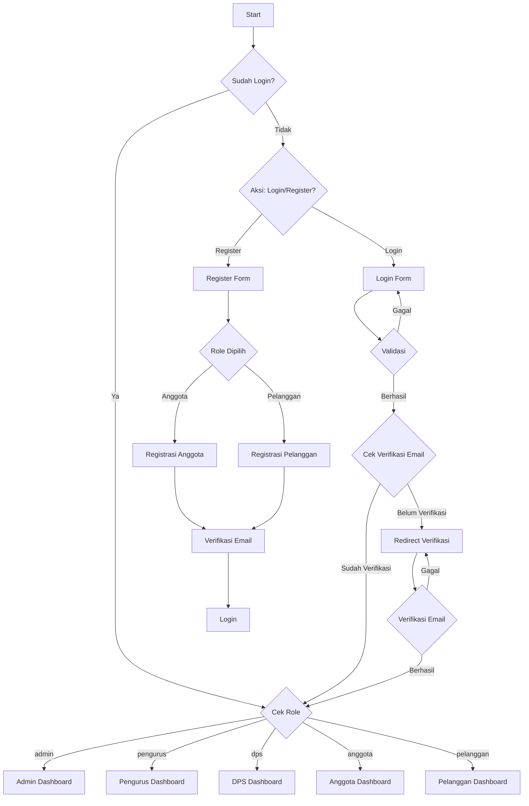
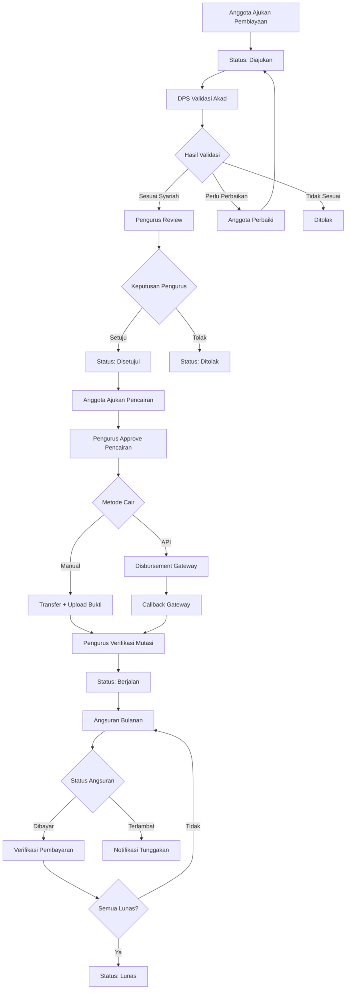

# Use Case Diagram - Sistem Koperasi Syariah

## Diagram Use Case Utama

```mermaid
flowchart TB
    subgraph Aktor["👤 Aktor Sistem"]
        GUEST["👤 Guest\n(Tamu)"]
        ADMIN["👤 Admin\n(Superuser)"]
        PENGURUS["👤 Pengurus\n(Manager Koperasi)"]
        DPS_USER["👤 DPS\n(Dewan Pengawas Syariah)"]
        ANGGOTA["👤 Anggota\n(Staff Koperasi)"]
        PELANGGAN["👤 Pelanggan\n(Marketplace)"]
    end

    subgraph GUEST_UC["🔐 Guest - Publik"]
        GUEST_UC_1["Browse Marketplace\nProduk Toko"]
        GUEST_UC_2["Lihat Detail Produk"]
        GUEST_UC_3["Login / Register"]
    end

    subgraph ADMIN_UC["⚙️ Admin - Sistem"]
        ADMIN_UC_1["Dashboard Statistik\nPengguna"]
        ADMIN_UC_2["Manajemen User\nCRUD + Filter"]
        ADMIN_UC_3["Export Data User\nCSV"]
        ADMIN_UC_4["Hapus User\nAkun"]
        ADMIN_UC_5["Lihat Notifikasi\nSistem"]
        ADMIN_UC_6["Kelola Profil"]
    end

    subgraph PENGURUS_UC["🏢 Pengurus - Koperasi"]
        PENGURUS_UC_1["Dashboard Operasional"]
        PENGURUS_UC_2["Kelola Anggota\nCRUD"]
        PENGURUS_UC_3["Review Pembiayaan\nApprove/Tolak"]
        PENGURUS_UC_4["Verifikasi Angsuran\nBukti Transfer"]
        PENGURUS_UC_5["Verifikasi Simpanan\nBukti Transfer"]
        PENGURUS_UC_6["Proses Pencairan Dana\nManual/API"]
        PENGURUS_UC_7["Kelola Rekening\nKoperasi"]
        PENGURUS_UC_8["Verifikasi Mutasi Kas\nJurnal"]
        PENGURUS_UC_9["Verifikasi Toko\nMarketplace"]
        PENGURUS_UC_10["Moderasi Produk\nMarketplace"]
        PENGURUS_UC_11["Broadcast Notifikasi\nKe Anggota"]
    end

    subgraph DPS_UC["🛡️ DPS - Pengawasan"]
        DPS_UC_1["Dashboard Pengawasan\nOperasional"]
        DPS_UC_2["Validasi Akad Syariah\nChecklist + Fatwa"]
        DPS_UC_3["Monitor Transaksi\nBaca Saja"]
        DPS_UC_4["Catat Temuan Audit\nResiko"]
        DPS_UC_5["Buat Opini Syariah\nRekomendasi"]
        DPS_UC_6["Buat Laporan\nPengawasan"]
        DPS_UC_7["Moderasi Produk\nDari Sisi Syariah"]
    end

    subgraph ANGGOTA_UC["👥 Anggota - Koperasi"]
        ANGGOTA_UC_1["Dashboard Anggota\nSimpanan + Pembiayaan"]
        ANGGOTA_UC_2["Setor Simpanan\nBukti Transfer"]
        ANGGOTA_UC_3["Ajukan Pembiayaan\nForm + Dokumen"]
        ANGGOTA_UC_4["Bayar Angsuran\nBukti Transfer"]
        ANGGOTA_UC_5["Ajukan Pencairan Dana\nRekening Tujuan"]
        ANGGOTA_UC_6["Lihat Bagi Hasil\nRiwayat"]
        ANGGOTA_UC_7["Kelola Lapak\nToko Saya"]
        ANGGOTA_UC_8["Kelola Produk\nLapak"]
        ANGGOTA_UC_9["Kelola Pesanan\nJual"]
        ANGGOTA_UC_10["Belanja di Marketplace\nBeli"]
        ANGGOTA_UC_11["Monitor Transaksi\nStatus"]
        ANGGOTA_UC_12["Kelola Profil\nAkun"]
    end

    subgraph PELanggan_UC["🛒 Pelanggan - Marketplace"]
        PELanggan_UC_1["Dashboard Pelanggan"]
        PELanggan_UC_2["Browse & Beli Produk\nCheckout"]
        PELanggan_UC_3["Bayar dengan QRIS\nPayment"]
        PELanggan_UC_4["Lihat Status Pesanan"]
    end

    %% Guest connections
    GUEST --> GUEST_UC_1
    GUEST --> GUEST_UC_2
    GUEST --> GUEST_UC_3

    %% Admin connections
    ADMIN --> ADMIN_UC_1
    ADMIN --> ADMIN_UC_2
    ADMIN --> ADMIN_UC_3
    ADMIN --> ADMIN_UC_4
    ADMIN --> ADMIN_UC_5
    ADMIN --> ADMIN_UC_6

    %% Pengurus connections
    PENGURUS --> PENGURUS_UC_1
    PENGURUS --> PENGURUS_UC_2
    PENGURUS --> PENGURUS_UC_3
    PENGURUS --> PENGURUS_UC_4
    PENGURUS --> PENGURUS_UC_5
    PENGURUS --> PENGURUS_UC_6
    PENGURUS --> PENGURUS_UC_7
    PENGURUS --> PENGURUS_UC_8
    PENGURUS --> PENGURUS_UC_9
    PENGURUS --> PENGURUS_UC_10
    PENGURUS --> PENGURUS_UC_11

    %% DPS connections
    DPS_USER --> DPS_UC_1
    DPS_USER --> DPS_UC_2
    DPS_USER --> DPS_UC_3
    DPS_USER --> DPS_UC_4
    DPS_USER --> DPS_UC_5
    DPS_USER --> DPS_UC_6
    DPS_USER --> DPS_UC_7

    %% Anggota connections
    ANGGOTA --> ANGGOTA_UC_1
    ANGGOTA --> ANGGOTA_UC_2
    ANGGOTA --> ANGGOTA_UC_3
    ANGGOTA --> ANGGOTA_UC_4
    ANGGOTA --> ANGGOTA_UC_5
    ANGGOTA --> ANGGOTA_UC_6
    ANGGOTA --> ANGGOTA_UC_7
    ANGGOTA --> ANGGOTA_UC_8
    ANGGOTA --> ANGGOTA_UC_9
    ANGGOTA --> ANGGOTA_UC_10
    ANGGOTA --> ANGGOTA_UC_11
    ANGGOTA --> ANGGOTA_UC_12

    %% Pelanggan connections
    PELANGGAN --> PELanggan_UC_1
    PELANGGAN --> PELanggan_UC_2
    PELANGGAN --> PELanggan_UC_3
    PELANGGAN --> PELanggan_UC_4
```



---

## Use Case Detail per Aktor

### 1. 👤 Guest (Tamu / Unauthenticated)

| ID | Use Case | Deskripsi |
|----|----------|-----------|
| G-01 | Browse Marketplace | Melihat daftar produk dari berbagai toko anggota |
| G-02 | Lihat Detail Produk | Melihat detail produk, harga, deskripsi, toko |
| G-03 | Login | Masuk ke sistem dengan email & password |
| G-04 | Register | Mendaftar akun baru sebagai anggota atau pelanggan |
| G-05 | Reset Password | Meminta reset password via email |
| G-06 | Keranjang Belanja | Menambahkan/menghapus produk ke keranjang (login diperlukan untuk checkout) |

---

### 2. ⚙️ Admin (Superuser)

| ID | Use Case | Deskripsi | Route |
|----|----------|-----------|-------|
| A-01 | Lihat Dashboard | Statistik total users per role, aktif/nonaktif, baru bulan ini | `/admin/dashboard` |
| A-02 | Daftar Users | Melihat semua users dengan filter role & status | `/admin/users` |
| A-03 | Detail User | Melihat detail profil + aktivitas (simpanan, pembiayaan, pesanan, toko) | `/admin/users/{id}` |
| A-04 | Hapus User | Menghapus akun user (kecuali akun admin sendiri) | `/admin/users/{id}` (DELETE) |
| A-05 | Export Users | Download data users sebagai file CSV | `/admin/users/export` |
| A-06 | Lihat Notifikasi | Melihat notifikasi database + inbox entries | `/admin/notifikasi` |
| A-07 | Tandai Dibaca | Menandai notifikasi sudah dibaca (per item / semua) | `/admin/notifikasi/{id}/read` |
| A-08 | Kelola Profil | Edit/update profil sendiri | `/profile` |

**Alur A-04 Hapus User:**
```
Admin → Pilih User → Konfirmasi Hapus
  → Bukan admin sendiri → Hapus user + session + notifikasi → Redirect ke daftar
  → Admin sendiri → Error: "Tidak bisa hapus akun sendiri"
```

---

### 3. 🏢 Pengurus (Manager Koperasi)

| ID | Use Case | Deskripsi | Route |
|----|----------|-----------|-------|
| P-01 | Dashboard Operasional | Ringkasan anggota, pembiayaan, transaksi hari ini | `/pengurus/dashboard` |
| P-02 | Kelola Anggota | CRUD anggota (tambah, edit, hapus) dengan simpanan pokok | `/pengurus/anggota` |
| P-03 | Review Pembiayaan | Menyetujui/menolak pengajuan pembiayaan (setelah validasi DPS) | `/pengurus/pembiayaan/{id}/approve` |
| P-04 | Lihat Angsuran | Melihat jadwal angsuran pembiayaan | `/pengurus/pembiayaan/{id}/angsuran` |
| P-05 | Verifikasi Angsuran | Verifikasi bukti transfer pembayaran angsuran | `/pengurus/transaksi/mutasi/{id}/approve` |
| P-06 | Verifikasi Simpanan | Verifikasi setoran simpanan anggota | `/pengurus/transaksi/mutasi/{id}/approve` |
| P-07 | Approve Pencairan | Menyetujui permintaan pencairan dana | `/pengurus/transaksi/pencairan/{id}/approve` |
| P-08 | Proses Transfer Manual | Mencatat bukti transfer manual (nomor ref + bukti) | `/pengurus/transaksi/pencairan/{id}/transfer` |
| P-09 | Proses Disbursement API | Mengirim pencairan via payment gateway API | `/pengurus/transaksi/pencairan/{id}/disbursement` |
| P-10 | Kelola Rekening | Menambah/mengaktifkan/menonaktifkan rekening koperasi | `/pengurus/transaksi/rekening` |
| P-11 | Verifikasi Mutasi | Verifikasi/tolak entri mutasi kas (jurnal terpusat) | `/pengurus/transaksi/mutasi/{id}/approve` |
| P-12 | Export Mutasi | Export data mutasi kas ke CSV | `/pengurus/transaksi/mutasi/export` |
| P-13 | Verifikasi Toko | Approve/reject toko anggota di marketplace | `/pengurus/marketplace/toko/{id}/approve` |
| P-14 | Moderasi Produk | Approve/reject produk anggota di marketplace | `/pengurus/marketplace/produk/{id}/approve` |
| P-15 | Broadcast Notifikasi | Mengirim notifikasi ke semua anggota | `/pengurus/marketplace/notifikasi/broadcast` |

**Alur P-03 Review Pembiayaan:**
```
Pengurus → Lihat Daftar Pembiayaan
  → Filter: status, akad, tanggal, pencarian
  → Pilih Pembiayaan → Lihat Detail
    → Cek Status Validasi DPS:
      → "Sesuai Syariah" + hash valid → Setujui → Generate Jadwal Angsuran → Notify Anggota
      → "Sesuai Syariah" + hash berubah → Error: "DPS harus validasi ulang"
      → "Menunggu" → Error: "Belum divalidasi DPS"
    → Atau → Tolak → Input Alasan → Notify Anggota
```

**Alur P-08/P-09 Pencairan Dana:**
```
Pengurus → Approve Pencairan
  → Pilih Rekening Koperasi Sumber
  → Metode: Manual / API
    → Manual: Upload bukti + nomor referensi + tanggal → Catat di Mutasi Kas
    → API: Kirim ke Payment Gateway → Menunggu Callback
```

---

### 4. 🛡️ DPS (Dewan Pengawas Syariah)

| ID | Use Case | Deskripsi | Route |
|----|----------|-----------|-------|
| D-01 | Dashboard Pengawasan | Ringkasan simpanan, pembiayaan, transaksi menunggu | `/dps/dashboard` |
| D-02 | Pengawasan Operasional | Monitor mutasi kas, simpanan, pembiayaan (baca saja) | `/dps/pengawasan` |
| D-03 | Daftar Akad | Melihat semua pembiayaan dengan filter validasi DPS | `/dps/audit` |
| D-04 | Detail Akad | Melihat detail struktur akad + riwayat validasi | `/dps/audit/{id}` |
| D-05 | Validasi Akad Syariah | Submit checklist validasi (sesuai/perlu_perbaikan/tidak_sesuai) | `/dps/audit` (POST) |
| D-06 | Riwayat Validasi | Melihat versi validasi sebelumnya | `/dps/audit/{id}/riwayat` |
| D-07 | Perbandingan Snapshot | Mendeteksi perubahan data akad setelah validasi | `/dps/audit/{id}/perbandingan` |
| D-08 | Catat Temuan Audit | Membuat temuan audit (risiko: rendah/sedang/tinggi/kritis) | `/dps/temuan` (POST) |
| D-09 | Update Temuan | Mengubah status temuan (Dibuka → Ditindaklanjuti → Diverifikasi → Ditutup) | `/dps/temuan/{id}` (PUT) |
| D-10 | Buat Opini Syariah | Membuat rekomendasi/opini syariah | `/dps/opini` (POST) |
| D-11 | Buat Laporan | Membuat laporan pengawasan | `/dps/laporan` (POST) |
| D-12 | Moderasi Produk (Syariah) | Review produk dari sisi kepatuhan syariah | `/dps/produk/{id}/review` |
| D-13 | Lihat Notifikasi | Melihat notifikasi sistem | `/dps/notifikasi` |

**Alur D-05 Validasi Akad Syariah:**
```
DPS → Pilih Pembiayaan → Lihat Detail Akad
  → Review Struktur Akad (margin/nisbah/objek)
  → Isi Checklist Validasi:
    → Pilih Hasil: Sesuai / Perlu Perbaikan / Tidak Sesuai
    → Isi per kriteria: Ya / Tidak / Catatan
    → Tulis Kesimpulan
    → Submit
  → Sistem:
    → Simpan snapshot data + hash
    → Cek blocking findings (data tidak lengkap)
    → Update status_validasi_dps pada pembiayaan
    → Notify Pengurus & Anggota
```

---

### 5. 👥 Anggota (Staff Koperasi)

| ID | Use Case | Deskripsi | Route |
|----|----------|-----------|-------|
| AN-01 | Dashboard Anggota | Ringkasan simpanan, pembiayaan aktif, notifikasi | `/anggota/dashboard` |
| AN-02 | Setor Simpanan | Mengirim bukti transfer setoran simpanan | `/anggota/transaksi/simpanan` |
| AN-03 | Lihat Simpanan | Melihat riwayat simpanan | `/anggota/simpanan` |
| AN-04 | Ajukan Pembiayaan | Mengajukan pembiayaan dengan form + dokumen | `/anggota/pembiayaan/ajukan` |
| AN-05 | Lihat Pembiayaan | Melihat status pembiayaan aktif + jadwal angsuran | `/anggota/pembiayaan` |
| AN-06 | Bayar Angsuran | Mengirim bukti transfer pembayaran angsuran | `/anggota/transaksi/angsuran` |
| AN-07 | Ajukan Pencairan | Mengajukan pencairan dana ke rekening tujuan | `/anggota/transaksi/pencairan` |
| AN-08 | Lihat Bagi Hasil | Melihat riwayat bagi hasil | `/anggota/bagi-hasil` |
| AN-09 | Lihat Monitoring | Monitoring status transaksi pribadi | `/anggota/monitoring` |
| AN-10 | Buka Lapak | Mendaftarkan toko di marketplace | `/anggota/lapak` |
| AN-11 | Kelola Produk | CRUD produk di lapak sendiri | `/anggota/lapak/produk` |
| AN-12 | Kelola Pesanan | Melihat & mengupdate status pesanan jual | `/anggota/lapak/pesanan` |
| AN-13 | Belanja Marketplace | Membeli produk dari toko anggota lain | `/marketplace` |
| AN-14 | Riwayat Pembayaran | Melihat riwayat pembayaran QRIS | `/anggota/payments/riwayat` |
| AN-15 | Kelola Profil | Edit/update profil | `/profile` |

**Alur AN-04 Ajukan Pembiayaan:**
```
Anggota → Form Pengajuan Pembiayaan
  → Pilih Jenis Akad: Murabahah / Mudharabah / Musyarakah / Ijarah / Qardh
  → Isi Data Akad (tergantung jenis):
    → Murabahah: Harga beli, margin%, DP, objek
    → Mudharabah: Modal, nisbah%, estimasi omzet/biaya
    → Musyarakah: Modal koperasi+anggota, nisbah%, estimasi
    → Ijarah: Nilai aset, ujrah/bulan, biaya perawatan
    → Qardh: Pokok pembiayaan, tenor
  → Upload Formulir Pengajuan (PDF/DOCX)
  → Submit → Status: "Diajukan" → Notify DPS & Pengurus
```

---

### 6. 🛒 Pelanggan (Marketplace)

| ID | Use Case | Deskripsi | Route |
|----|----------|-----------|-------|
| PL-01 | Dashboard Pelanggan | Ringkasan pesanan | `/pelanggan/dashboard` |
| PL-02 | Browse Produk | Melihat produk dari berbagai toko | `/marketplace` |
| PL-03 | Detail Produk | Melihat detail, harga, rating, deskripsi | `/marketplace/produk/{slug}` |
| PL-04 | Keranjang Belanja | Menambahkan produk ke keranjang | `/marketplace/keranjang` |
| PL-05 | Checkout | Memilih produk & metode pembayaran | `/marketplace/checkout` |
| PL-06 | Bayar QRIS | Pembayaran via QR code (QRIS) | Webhook callback |
| PL-07 | Lihat Pesanan | Melihat status pesanan | `/pesanan-saya` |
| PL-08 | Tandai Diterima | Mengkonfirmasi barang diterima | `/pesanan-saya/{id}/terima` |

**Alur PL-05 Checkout:**
```
Pelanggan → Keranjang → Checkout
  → Pilih Produk dari Keranjang
  → Review Total Harga
  → Submit Order → Status: "pending"
  → Generate QRIS → Scan QR → Bayar
  → Webhook Callback → Status: "paid"
  → Pengurus Verifikasi → Proses Pengiriman
```

---

## Matrix Hak Akses (Role-Based Access Control)

| Modul | Guest | Admin | Pengurus | DPS | Anggota | Pelanggan |
|-------|:-----:|:-----:|:--------:|:---:|:-------:|:---------:|
| **Autentikasi** | R | U | U | U | U | U |
| **Dashboard** | - | A | A | A | A | A |
| **User Management** | - | CRD | - | - | - | - |
| **Anggota CRUD** | - | - | CRUD | - | - | - |
| **Pembiayaan** | - | R | RUD | R | CR | - |
| **Validasi Akad DPS** | - | - | - | CR | - | - |
| **Angsuran** | - | - | RU | R | CR | - |
| **Simpanan** | - | - | RU | R | CR | - |
| **Pencairan Dana** | - | - | RUD | R | CR | - |
| **Mutasi Kas** | - | - | RUD | R | - | - |
| **Rekening Koperasi** | - | - | CRU | - | - | - |
| **Toko/Marketplace** | R | R | RU | R | CR | R |
| **Produk** | R | R | RU | RU | CRUD | R |
| **Pesanan** | - | - | - | - | RU | RU |
| **Temuan Audit** | - | - | - | CRU | - | - |
| **Opini Syariah** | - | - | - | CR | - | - |
| **Laporan Pengawasan** | - | - | - | CRU | - | - |
| **Notifikasi** | - | R | R | R | R | R |
| **Profil** | - | U | U | U | U | U |

> **Keterangan:** C = Create, R = Read, U = Update, D = Delete, `-` = Tidak Akses

---

## Alur Autentikasi Utama



---

## Alur Kerja Pembiayaan (End-to-End)


